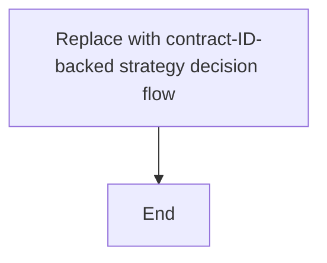
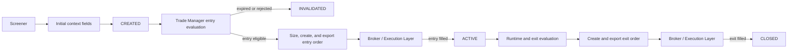

# Strategy Playbook: <Canonical Strategy Name>

## 1. Identity

| Field | Contract value | Normative source ID |
|---|---|---|
| Strategy identifier | | |
| Display name | | |
| Strategy family | | |
| Variants | | |
| Lifecycle status | | |
| Playbook version | | |

## 2. Verification Status

| Dimension | Status | Review date | Review scope | Evidence IDs |
|---|---|---|---|---|
| Specification completeness | INCOMPLETE | N/A | Migration inventory | |
| Implementation conformance | NOT_REVIEWED | N/A | Not reviewed | |
| Configuration conformance | NOT_REVIEWED | N/A | Not reviewed | |
| Test coverage | NOT_REVIEWED | N/A | Not reviewed | |

## 3. Source Register

| Source ID | Path or reference | Role | Git commit/version | Scope reviewed | Status |
|---|---|---|---|---|---|

Allowed roles: `NORMATIVE`, `ARCHITECTURE_NORMATIVE`, `CONFIGURATION_NORMATIVE`, `IMPLEMENTATION_EVIDENCE`, `TEST_EVIDENCE`, `SUPPORTING`.

## 4. Objective

### Core concept

### Economic or behavioral hypothesis

### Expected market regime

### Hypothesis invalidation

### Known limitations

## 5. Responsibility Contract

Document only strategy-specific responsibilities and deviations from `overview.md`.

| Contract ID | Responsibility | Screener | Trade Manager | Broker / Execution Layer | Normative source ID | Implementation conformance |
|---|---|---|---|---|---|---|

## 6. Universe and Data Contract

### Universe

| Contract ID | Property | Contract value | Normative source ID | Implementation conformance |
|---|---|---|---|---|

### Required market data

| Contract ID | Field | Frequency | Adjustment policy | Minimum history | Required | Normative source ID | Implementation conformance |
|---|---|---|---|---:|---|---|---|

### Data freshness and cutoff

| Contract ID | Property | Contract value | Normative source ID | Implementation conformance |
|---|---|---|---|---|

## 7. Configuration Contract

| Contract ID | Business parameter | Full configuration key | Type | Unit | Required | Resolved default | Variant-specific | Normative source ID | Configuration conformance |
|---|---|---|---|---|---|---|---|---|---|

## 8. Mathematical Contract

| Contract ID | Name | Exact formula | Inputs and offsets | Unit | Parameter source | Used by | Equality/zero behavior | Normative source ID | Implementation conformance | Test coverage |
|---|---|---|---|---|---|---|---|---|---|---|

## 9. Trading Timeline

| Contract ID | Event | Time or phase | Trading-day rule | Holiday behavior | Normative source ID | Implementation conformance |
|---|---|---|---|---|---|---|

| Contract ID | Property | Contract value | Normative source ID | Implementation conformance |
|---|---|---|---|---|
| | Exchange timezone | | | |
| | Effective trading date | | | |
| | Data cutoff | | | |
| | Look-ahead prevention | | | |
| | Order cutoff assumptions | | | |

## 10. Screener Decision Contract

### Inputs and indicators

| Contract ID | Input or indicator | Exact definition | Lookback/warm-up | Missing-data behavior | Normative source ID | Implementation conformance | Test coverage |
|---|---|---|---|---|---|---|---|

### Conditions

| Contract ID | Exact condition | Required | Evaluation order | Missing-data behavior | Normative source ID | Implementation conformance | Test coverage |
|---|---|---:|---|---|---|---|---|

### Final Boolean relationship

### Ranking and candidate selection

### Duplicate and existing-position checks

### Signal creation

### Notification behavior

## 11. Signal Output Contract

### Signal fields

| Contract ID | Field | Type | Required | Exact value or meaning | Normative source ID | Implementation conformance | Test coverage |
|---|---|---|---|---|---|---|---|

### Entry semantics

| Contract ID | Property | Contract value | Normative source ID | Implementation conformance | Test coverage |
|---|---|---|---|---|---|
| | Stored reference | | | | |
| | Entry eligibility time | | | | |
| | Entry trigger | | | | |
| | Broker order type | | | | |
| | Time-in-force / execution instruction | | | | |
| | Actual fill rule | | | | |
| | Entry expiration | | | | |
| | Rounding/tick behavior | | | | |

### Initial `signal_context`

| Contract ID | Field | Type | Exact meaning/formula | Unit | Decision use | Normative source ID | Implementation conformance | Test coverage |
|---|---|---|---|---|---|---|---|---|

## 12. Trade Manager Entry Contract

| Contract ID | Priority | Preconditions and trigger | Eligible time | Broker order type and TIF | Actual fill rule | Resulting status/reason | Normative source ID | Implementation conformance | Test coverage |
|---|---:|---|---|---|---|---|---|---|---|

### Entry expiration and invalidation

### Position sizing

| Contract ID | Property | Contract value | Normative source ID | Implementation conformance |
|---|---|---|---|---|
| | Sizing owner | | | |
| | Budget or risk basis | | | |
| | Full configuration key | | | |
| | Zero-size behavior | | | |
| | Decimal boundary | | | |

## 13. Runtime State Contract

### Daily inputs and indicators

| Contract ID | Input or indicator | Exact definition | Normative source ID | Implementation conformance | Test coverage |
|---|---|---|---|---|---|

### Mutable runtime fields

| Contract ID | Field | Initial value | Exact update rule | Update timing | Duplicate guard | Decision use | Normative source ID | Implementation conformance | Test coverage |
|---|---|---|---|---|---|---|---|---|---|

### Update sequence

## 14. Exit Contract

| Contract ID | Priority | Exact exit condition | Earliest eligible time | Broker order type and TIF | Actual fill rule | Final status | Reason code | Normative source ID | Implementation conformance | Test coverage |
|---|---:|---|---|---|---|---|---|---|---|---|

| Contract ID | Property | Contract value | Normative source ID | Implementation conformance |
|---|---|---|---|---|
| | Simultaneous-condition behavior | | | |
| | Evaluation order | | | |
| | Non-trigger behavior | | | |
| | Terminal state | | | |

## 15. Portfolio Reconciliation

Use `NOT_APPLICABLE` only with a documented reason and source.

| Contract ID | Property | Contract value | Normative source ID | Implementation conformance | Test coverage |
|---|---|---|---|---|---|
| | Target portfolio | | | | |
| | Current portfolio | | | | |
| | Positions to keep | | | | |
| | Positions to close | | | | |
| | Positions to open | | | | |
| | Already-active handling | | | | |
| | Regime-off behavior | | | | |
| | Operation order | | | | |
| | Partial execution behavior | | | | |

## 16. Persistence Contract

| Contract ID | Artifact or field | Producer | Creation time | Storage target | Mutable | Updater | Terminal behavior | Normative source ID | Implementation conformance | Test coverage |
|---|---|---|---|---|---|---|---|---|---|---|

| Contract ID | Property | Contract value | Normative source ID | Implementation conformance |
|---|---|---|---|---|
| | Uniqueness key | | | |
| | Idempotency behavior | | | |
| | Duplicate-run behavior | | | |
| | Transaction boundary | | | |
| | Partial-run behavior | | | |
| | Cleanup behavior | | | |
| | Persistence failure behavior | | | |

## 17. Decision Flow

| Mermaid element | Contract IDs |
|---|---|

## 18. Execution Flow

| Mermaid element | Contract IDs |
|---|---|

## 19. Optional State Models

`NOT_APPLICABLE` - replace with a sourced reason or add contract-ID-backed state diagrams.

## 20. Implementation Mapping

| Contract ID | Module path | Symbol | Relevant branch/lines | Evidence ID | Conformance status | Notes |
|---|---|---|---|---|---|---|

## 21. Test Mapping

| Contract ID | Test path | Test symbol | Evidence ID | Coverage status | Notes |
|---|---|---|---|---|---|

## 22. Known Conflicts and Gaps

| Conflict ID | Type | Subject | Normative value/source | Other or observed value/source | Affected contract IDs | Resolution status | Required decision owner |
|---|---|---|---|---|---|---|---|
