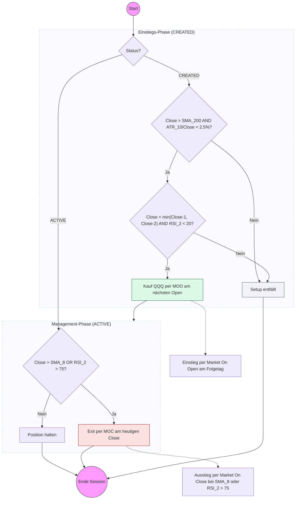

# Strategy Playbook: Bounce Bandit (BOUNCE_BANDIT)

- **Core Concept:** High-probability mean-reversion ETF strategy (targeting `QQQ`) that buys sharp, low-volatility pullbacks in an established long-term uptrend and exits rapidly upon short-term mean reversion.
- **Screener Ingestion:** Reads daily closing prices and quotes from `stocks.db` for the target symbol `QQQ`:
  - `close`: Daily closing price ($Close$).
  - `high`: Daily high price ($High$).
  - `low`: Daily low price ($Low$).
  - `date`: Trading day timestamp string.
- **Screener Rules & Filters:**
  - **Constituent Selection**: Traded exclusively on `QQQ` (no other assets screened).
  - **Uptrend Regime Filter**: Daily close must be strictly above its 200-day Simple Moving Average ($Close_t > \text{SMA}_{200}$).
  - **Volatility Filter**: 10-day ATR percentage must be below 2.5% ($\text{ATR}_{10} / Close_t \times 100 < 2.5\%$).
  - **Pullback Condition**: Daily close must be strictly below both of the prior two days' closing prices ($Close_t < \min(Close_{t-1}, Close_{t-2})$).
  - **Oversold Filter**: 2-period RSI must be below 20 ($\text{RSI}_2(Close_t) < 20$).
  - **Duplicate / Position Guard**: Maximum 1 concurrent position. Prevents entry if an active trade or setup already exists for the symbol.
- **Signal Triggers & Order Types:**
  - **Entry Order Type**: Market On Open (MOO) at next day's open ($Open_{t+1}$).
  - **Stop-Loss**: None (`0.0`).
  - **Exit Order Type & Logic**: Evaluated at Market On Close (MOC) on any active holding day (including entry day if exit condition triggers):
    - Exit MOC if $Close_t > \text{SMA}_8(Close_t)$ OR $\text{RSI}_2(Close_t) > 75$.
- **Position Sizing & Risk Management:**
  - Standard **Budget-Based Fallback**: Calculated using standard portfolio allocation without a hard stop loss ($\text{size} = \lfloor \text{budget} / P_{\text{fill}} \rfloor$), configured via `portfolio.strategies.bounce_bandit.budget`.
- **Configurable Parameters:**
  - `trend_sma_len`: Long-term trend SMA period (default: `200`).
  - `atr_len`: Volatility ATR period (default: `10`).
  - `max_atr_pct`: Maximum ATR volatility threshold percentage (default: `2.5`).
  - `rsi_entry_threshold`: RSI 2 entry threshold (default: `20`).
  - `exit_sma_len`: Mean-reversion exit SMA period (default: `8`).
  - `rsi_exit_threshold`: RSI 2 exit threshold (default: `75`).
  - `target_symbol`: Target asset ticker (default: `"QQQ"`).

---

## Strategy Decision Flowchart

