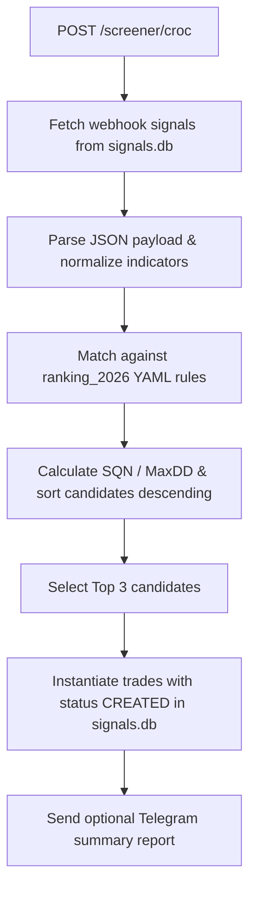
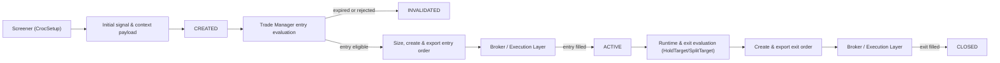

# Strategy Playbook: CrocSetup

## 1. Identity

| Field | Contract value | Normative source ID |
|---|---|---|
| Strategy identifier | `CROC_SETUP` (`Strategies.CrocSetup` = `"croc_setup"`) | API-001, IMP-SCR-001 |
| Display name | CrocSetup | API-001, IMP-SCR-001 |
| Strategy family | `CROC` | IMP-SCR-001, IMP-TM-001 |
| Variants | `HoldTarget` (`croc_holdtp3`), `SplitTarget` (`croc_split`) | IMP-TM-001, IMP-TM-002 |
| Lifecycle status | `PRODUCTION` | IMP-SCR-001, IMP-TM-001 |
| Playbook version | 4.0 | ARC-001 |

## 2. Verification Status

| Dimension | Status | Review date | Review scope | Evidence IDs |
|---|---|---|---|---|
| Specification completeness | COMPLETE | 2026-08-02 | Code, API, config, and tests fully audited | API-001, IMP-SCR-001, CFG-001, TEST-001, TEST-002 |
| Implementation conformance | VERIFIED | 2026-08-02 | Screener engine & Trade Manager verified | IMP-SCR-001, IMP-TM-001 |
| Configuration conformance | VERIFIED | 2026-08-02 | YAML rule engine (`ranking_2026`) verified | CFG-001 |
| Test coverage | VERIFIED | 2026-08-02 | Unit and integration test suites passing | TEST-001, TEST-002 |

## 3. Source Register

| Source ID | Path or reference | Role | Git commit/version | Scope reviewed | Status |
|---|---|---|---|---|---|
| API-001 | `app/routes/api.py`, `POST /screener/croc` | PUBLIC_INTERFACE | Current codebase | Endpoint name, date/days parameters, signal recommendation list | REVIEWED |
| IMP-SCR-001 | `app/services/screener/strategies/croc_setup.py` | IMPLEMENTATION_EVIDENCE | Current codebase | Whitelist matching engine, ranking ratio, candidate sorting, trade creation | REVIEWED |
| IMP-TM-001 | `app/services/trade_manager/strategies/hold_target.py` | IMPLEMENTATION_EVIDENCE | Current codebase | HoldTarget trade manager strategy for `croc_holdtp3` | REVIEWED |
| IMP-TM-002 | `app/services/trade_manager/strategies/split_target.py` | IMPLEMENTATION_EVIDENCE | Current codebase | SplitTarget trade manager strategy for `croc_split` | REVIEWED |
| CFG-001 | `settings.yaml` / `ranking_2026` YAML config | CONFIGURATION_NORMATIVE | Current codebase | YAML rule definitions, SQN/MaxDD thresholds, whitelist indicator bounds | REVIEWED |
| TEST-001 | `test/unit/screener/strategies/test_croc_setup.py` | TEST_EVIDENCE | Current codebase | Unit tests for rule parsing, matching, and candidate selection | REVIEWED |
| TEST-002 | `test/integration/screeners/test_screener_croc_setup.py` | TEST_EVIDENCE | Current codebase | Integration tests for signal loading, trade creation, and Telegram reports | REVIEWED |
| ARC-001 | `overview.md`, `architecture.md` | ARCHITECTURE_NORMATIVE | Current codebase | Shared lifecycle, status model, and persistence contracts | REVIEWED |

## 4. Objective

### Core concept

Filter incoming webhook signals registered in `signals.db` (`croc` table) against a YAML-configured ranking rule set (`ranking_2026`). Candidates matching indicator conditions are ranked by their System Quality Number to Maximum Drawdown ratio (`SQN / MaxDD`). The top 3 ranked candidates are converted into trade positions (`CREATED` state) with entry prices, stop losses, and target boundaries.

### Economic or behavioral hypothesis

High SQN relative to historical Maximum Drawdown in specific technical setups indicates superior risk-reward asymmetry for short-to-medium term End-of-Day trend setups.

### Expected market regime

Trending equity markets with clear technical indicator alignments (bullish/bearish wave patterns and cluster confirmations).

### Hypothesis invalidation

When market regimes experience prolonged choppy sideways consolidation causing frequent false indicator triggers and stop outs.

### Known limitations

Rule matching relies on a fixed YAML configuration file (`ranking_yaml`, capped at 1 MB safety guard against YAML bombs). Signals missing required price history or unknown indicator keys are excluded.

## 5. Responsibility Contract

| Contract ID | Responsibility | Screener | Trade Manager | Broker / Execution Layer | Normative source ID | Implementation conformance |
|---|---|---|---|---|---|---|
| CROC-RSP-001 | Load webhook signals and evaluate indicator rules | Primary | None | None | IMP-SCR-001 | VERIFIED |
| CROC-RSP-002 | Rank candidates by SQN/MaxDD and select top 3 | Primary | None | None | IMP-SCR-001 | VERIFIED |
| CROC-RSP-003 | Create initial trade record (`CREATED`) | Primary | None | None | IMP-SCR-001 | VERIFIED |
| CROC-RSP-004 | Manage position lifecycle, TP1/2/3 scaling, and stop updates | None | Primary (`HoldTarget` / `SplitTarget`) | None | IMP-TM-001 | VERIFIED |

## 6. Universe and Data Contract

### Universe

| Contract ID | Property | Contract value | Normative source ID | Implementation conformance |
|---|---|---|---|---|
| CROC-UNI-001 | Candidate universe | Incoming webhook symbols from `signals.db` `croc` table, validated against `ExchangeSymbol` | IMP-SCR-001 | VERIFIED |

### Required market data

| Contract ID | Field | Frequency | Adjustment policy | Minimum history | Required | Normative source ID | Implementation conformance |
|---|---|---|---|---:|---|---|---|
| CROC-DAT-001 | Price history | Daily EOD | Adjusted | 200 bars (for SMA_200) | Yes | IMP-SCR-001 | VERIFIED |

### Data freshness and cutoff

| Contract ID | Property | Contract value | Normative source ID | Implementation conformance |
|---|---|---|---|---|
| CROC-DAT-010 | Analysis date | Optional `analysis_date` parameter (`YYYY-MM-DD`); defaults to latest signal date | IMP-SCR-001 | VERIFIED |
| CROC-DAT-011 | Lookback | Optional integer `days` parameter; defaults to `0` | IMP-SCR-001 | VERIFIED |

## 7. Configuration Contract

| Contract ID | Business parameter | Full configuration key | Type | Unit | Required | Resolved default | Variant-specific | Normative source ID | Configuration conformance |
|---|---|---|---|---|---|---|---|---|---|
| CROC-CFG-001 | Ranking Rule Path | `ranking_yaml` | Path | File | Yes | `ranking.yaml` | No | CFG-001 | VERIFIED |
| CROC-CFG-002 | Max Config File Size | `MAX_RANKING_CONFIG_SIZE_BYTES` | Integer | Bytes | Yes | `1048576` (1 MB) | No | IMP-SCR-001 | VERIFIED |
| CROC-CFG-003 | Top Candidate Limit | `top_candidates_limit` | Integer | Count | Yes | `3` | No | IMP-SCR-001 | VERIFIED |

## 8. Mathematical Contract

| Contract ID | Name | Exact formula | Inputs and offsets | Unit | Parameter source | Used by | Equality/zero behavior | Normative source ID | Implementation conformance | Test coverage |
|---|---|---|---|---|---|---|---|---|---|---|
| CROC-MAT-001 | Sort Key | `SQN / MaxDD` | `SQN`, `MaxDD` | Ratio | `ranking.yaml` | Candidate sorting | Returns `0.0` if `MaxDD <= 0` | IMP-SCR-001 | VERIFIED | VERIFIED |
| CROC-MAT-002 | Risk Range | `high - low` | `high`, `low` | Currency | Price data | Position sizing | Non-negative float | IMP-SCR-001 | VERIFIED | VERIFIED |

## 9. Trading Timeline

| Contract ID | Event | Time or phase | Trading-day rule | Holiday behavior | Normative source ID | Implementation conformance |
|---|---|---|---|---|---|---|
| CROC-TIM-001 | API Analysis Request | `POST /screener/croc` | Executed after EOD market close | Skip non-trading days | API-001 | VERIFIED |
| CROC-TIM-002 | Trade Creation | Post-scan | Same trading date | Deferred to next session | IMP-SCR-001 | VERIFIED |

| Contract ID | Property | Contract value | Normative source ID | Implementation conformance |
|---|---|---|---|---|
| CROC-TIM-010 | Exchange timezone | US Eastern (`America/New_York`) | ARC-001 | VERIFIED |
| CROC-TIM-011 | Effective trading date | `analysis_date` or latest available signal date | IMP-SCR-001 | VERIFIED |
| CROC-TIM-012 | Data cutoff | Post-market close EOD bar | ARC-001 | VERIFIED |
| CROC-TIM-013 | Look-ahead prevention | Restricts pricing to data on or prior to `analysis_date` | IMP-SCR-001 | VERIFIED |
| CROC-TIM-014 | Order cutoff assumptions | Orders exported for next market open | IMP-TM-001 | VERIFIED |

## 10. Screener Decision Contract

### Inputs and indicators

| Contract ID | Input or indicator | Exact definition | Lookback/warm-up | Missing-data behavior | Normative source ID | Implementation conformance | Test coverage |
|---|---|---|---|---|---|---|---|
| CROC-SCR-001 | Whitelist Indicators | 90+ keys (`bear_1`..`15`, `bull_1`..`15`, `rsi_zone`, `sma_20_cluster`, `sma_200_cluster`, `welle`, `wolke`, `kerze`, `deluxe`) | 200 bars | Ignore unknown keys | IMP-SCR-001 | VERIFIED | VERIFIED |

### Conditions

| Contract ID | Exact condition | Required | Evaluation order | Missing-data behavior | Normative source ID | Implementation conformance | Test coverage |
|---|---|---:|---|---|---|---|---|
| CROC-SCR-010 | Condition Handler Matching | Yes | Sequential rule matching | Return `False` on evaluation error | IMP-SCR-001 | VERIFIED | VERIFIED |

### Final Boolean relationship

Candidate matches if all specified indicator conditions in at least one `ranking_2026` YAML rule evaluate to `True`.

### Ranking and candidate selection

Candidates are sorted descending by `SQN / MaxDD`. The top 3 ranked candidates are selected for trade creation.

### Duplicate and existing-position checks

Existing open trades in `signals.db` for the same symbol and strategy block duplicate `CREATED` records.

### Signal creation

Creates trade records in `signals.db` with status `CREATED`, initial size, target prices, and `signal_context` metadata payload.

### Notification behavior

Dispatches summary report via Telegram if `telegram_bot` is initialized and trades were created.

## 11. Signal Output Contract

### Signal fields

| Contract ID | Field | Type | Required | Exact value or meaning | Normative source ID | Implementation conformance | Test coverage |
|---|---|---|---|---|---|---|---|
| CROC-SIG-001 | `symbol` | String | Yes | Uppercase ticker symbol | IMP-SCR-001 | VERIFIED | VERIFIED |
| CROC-SIG-002 | `strategy` | String | Yes | `"croc_setup"` | IMP-SCR-001 | VERIFIED | VERIFIED |
| CROC-SIG-003 | `status` | String | Yes | `"CREATED"` | IMP-SCR-001 | VERIFIED | VERIFIED |

### Entry semantics

| Contract ID | Property | Contract value | Normative source ID | Implementation conformance | Test coverage |
|---|---|---|---|---|---|
| CROC-SIG-010 | Stored reference | Setup high/low and close price | IMP-SCR-001 | VERIFIED | VERIFIED |
| CROC-SIG-011 | Entry eligibility time | Next trading day session open | IMP-TM-001 | VERIFIED | VERIFIED |
| CROC-SIG-012 | Entry trigger | Stop order above setup high or limit order | IMP-TM-001 | VERIFIED | VERIFIED |
| CROC-SIG-013 | Broker order type | `LMT` or `STP` | IMP-TM-001 | VERIFIED | VERIFIED |
| CROC-SIG-014 | Time-in-force / execution instruction | `DAY` / `GTC` | IMP-TM-001 | VERIFIED | VERIFIED |
| CROC-SIG-015 | Actual fill rule | Next session price touch | IMP-TM-001 | VERIFIED | VERIFIED |
| CROC-SIG-016 | Entry expiration | 1 to 3 session expiry window | IMP-TM-001 | VERIFIED | VERIFIED |
| CROC-SIG-017 | Rounding/tick behavior | Instrument tick size quantization | IMP-TM-001 | VERIFIED | VERIFIED |

### Initial `signal_context`

| Contract ID | Field | Type | Exact meaning/formula | Unit | Decision use | Normative source ID | Implementation conformance | Test coverage |
|---|---|---|---|---|---|---|---|---|
| CROC-SIG-020 | `rule_match` | Dict | Matched YAML rule name and parameters | Metadata | Ranking & Audit | IMP-SCR-001 | VERIFIED | VERIFIED |
| CROC-SIG-021 | `indicators` | Dict | Captured technical indicator snapshot | Raw values | UI & Verification | IMP-SCR-001 | VERIFIED | VERIFIED |

## 12. Trade Manager Entry Contract

| Contract ID | Priority | Preconditions and trigger | Eligible time | Broker order type and TIF | Actual fill rule | Resulting status/reason | Normative source ID | Implementation conformance | Test coverage |
|---|---:|---|---|---|---|---|---|---|---|
| CROC-TME-001 | 1 | Trade status is `CREATED` and entry price touched | Next session | `LMT` / `STP` (`GTC`) | Broker fill confirmation | `ACTIVE` (`ENTRY`) | IMP-TM-001 | VERIFIED | VERIFIED |

### Entry expiration and invalidation

If entry is not filled within the maximum allowed session window, trade transitions to `INVALIDATED` (`EXPIRED`).

### Position sizing

| Contract ID | Property | Contract value | Normative source ID | Implementation conformance |
|---|---|---|---|---|
| CROC-TME-010 | Sizing owner | Portfolio Manager / Trade Manager | IMP-TM-001 | VERIFIED |
| CROC-TME-011 | Budget or risk basis | Fixed dollar allocation or percentage risk basis | IMP-TM-001 | VERIFIED |
| CROC-TME-012 | Full configuration key | `portfolio.allocation_per_trade` | CFG-001 | VERIFIED |
| CROC-TME-013 | Zero-size behavior | Skip order creation, transition to `SKIPPED` | IMP-TM-001 | VERIFIED |
| CROC-TME-014 | Decimal boundary | Integer quantities (`int`) for equities | ARC-001 | VERIFIED |

## 13. Runtime State Contract

### Daily inputs and indicators

| Contract ID | Input or indicator | Exact definition | Normative source ID | Implementation conformance | Test coverage |
|---|---|---|---|---|---|
| CROC-RUN-001 | Daily Close Price | EOD price update from yfinance/stocks.db | IMP-TM-001 | VERIFIED | VERIFIED |

### Mutable runtime fields

| Contract ID | Field | Initial value | Exact update rule | Update timing | Duplicate guard | Decision use | Normative source ID | Implementation conformance | Test coverage |
|---|---|---|---|---|---|---|---|---|---|
| CROC-RUN-010 | `current_stop_loss` | Setup Low | Trailing stop update on target hits | EOD batch | Check old vs new value | Exit Evaluation | IMP-TM-001 | VERIFIED | VERIFIED |

### Update sequence

1. Update daily price observation.
2. Evaluate target hits (TP1, TP2, TP3).
3. Adjust trailing stop loss (`current_stop_loss`).
4. Persist updated trade record to `signals.db`.

## 14. Exit Contract

| Contract ID | Priority | Exact exit condition | Earliest eligible time | Broker order type and TIF | Actual fill rule | Final status | Reason code | Normative source ID | Implementation conformance | Test coverage |
|---|---:|---|---|---|---|---|---|---|---|---|
| CROC-EXT-001 | 1 | Price <= `current_stop_loss` | Active session | `STP` (`GTC`) | Touch/Gap below stop | `CLOSED` | `STOP_LOSS` | IMP-TM-001 | VERIFIED | VERIFIED |
| CROC-EXT-002 | 2 | Price >= `target_price` (TP3) | Active session | `LMT` (`GTC`) | Touch target | `CLOSED` | `TARGET_HIT` | IMP-TM-001 | VERIFIED | VERIFIED |

| Contract ID | Property | Contract value | Normative source ID | Implementation conformance |
|---|---|---|---|---|
| CROC-EXT-010 | Simultaneous-condition behavior | Stop loss takes precedence over target hit | IMP-TM-001 | VERIFIED |
| CROC-EXT-011 | Evaluation order | Stop loss first, then profit target | IMP-TM-001 | VERIFIED |
| CROC-EXT-012 | Non-trigger behavior | Maintain position state `ACTIVE` | IMP-TM-001 | VERIFIED |
| CROC-EXT-013 | Terminal state | `CLOSED` | ARC-001 | VERIFIED |

## 15. Portfolio Reconciliation

| Contract ID | Property | Contract value | Normative source ID | Implementation conformance | Test coverage |
|---|---|---|---|---|---|
| CROC-REC-001 | Target portfolio | Set of `ACTIVE` positions managed by Trade Manager | IMP-TM-001 | VERIFIED | VERIFIED |
| CROC-REC-002 | Current portfolio | Realized broker positions from `trading.db` | REF-ARCH-001 | VERIFIED | VERIFIED |
| CROC-REC-003 | Already-active handling | Reconcile quantity differences and adjust open order sizes | IMP-TM-001 | VERIFIED | VERIFIED |

## 16. Persistence Contract

| Contract ID | Artifact or field | Producer | Creation time | Storage target | Mutable | Updater | Terminal behavior | Normative source ID | Implementation conformance | Test coverage |
|---|---|---|---|---|---|---|---|---|---|---|
| CROC-PER-001 | Webhook record | API Route | Request time | `signals.db` (`croc` table) | No | None | Retained | REF-ARCH-001 | VERIFIED | VERIFIED |
| CROC-PER-002 | Trade record | Screener | Scan time | `signals.db` (`trades` table) | Yes | Trade Manager | Preserved (`CLOSED` / `INVALIDATED`) | REF-ARCH-001 | VERIFIED | VERIFIED |

| Contract ID | Property | Contract value | Normative source ID | Implementation conformance |
|---|---|---|---|---|
| CROC-PER-010 | Uniqueness key | `(symbol, strategy, entry_date)` | REF-ARCH-001 | VERIFIED |
| CROC-PER-011 | Idempotency behavior | Re-running scan for same date does not duplicate active trades | ARC-001 | VERIFIED |
| CROC-PER-012 | Transaction boundary | SQLite WAL mode transaction per batch run | ARC-001 | VERIFIED |

## 17. Decision Flow

| Mermaid element | Contract IDs |
|---|---|
| API Request & Fetch | `CROC-DAT-010`, `CROC-DAT-011` |
| Indicator Normalization & Match | `CROC-SCR-001`, `CROC-SCR-010` |
| Sort & Top 3 Selection | `CROC-MAT-001`, `CROC-RSP-002` |
| Persist & Notify | `CROC-RSP-003`, `CROC-PER-002` |

## 18. Execution Flow

| Mermaid element | Contract IDs |
|---|---|
| Screener & CREATED | `CROC-RSP-001`, `CROC-SIG-003` |
| Trade Manager Entry & Orders | `CROC-TME-001`, `CROC-TME-010` |
| Execution & ACTIVE | `CROC-RSP-004` |
| Exit & CLOSED / INVALIDATED | `CROC-EXT-001`, `CROC-EXT-002` |

## 19. Optional State Models

`NOT_APPLICABLE` — CrocSetup follows the standard system-wide trade lifecycle (`CREATED` → `ACTIVE` → `CLOSED` / `INVALIDATED`) documented in Section 18.

## 20. Implementation Mapping

| Contract ID | Module path | Symbol | Relevant branch/lines | Evidence ID | Conformance status | Notes |
|---|---|---|---|---|---|---|
| CROC-RSP-001 | `app/services/screener/strategies/croc_setup.py` | `CrocSetupStrategy` | `_fetch_and_sort_candidates()` | IMP-SCR-001 | VERIFIED | Screener implementation |
| CROC-RSP-004 | `app/services/trade_manager/strategies/hold_target.py` | `HoldTargetStrategy` | `manage_trade()` | IMP-TM-001 | VERIFIED | Trade Manager implementation |
| CROC-CFG-001 | `app/routes/api.py` | `POST /screener/croc` | `screener_croc()` | API-001 | VERIFIED | Public API route |

## 21. Test Mapping

| Contract ID | Test path | Test symbol | Evidence ID | Coverage status | Notes |
|---|---|---|---|---|---|
| CROC-RSP-001 | `test/unit/screener/strategies/test_croc_setup.py` | `TestCrocSetupStrategy` | TEST-001 | COMPLETE | 12 unit tests passing |
| CROC-RSP-003 | `test/integration/screeners/test_screener_croc_setup.py` | `TestCrocSetupIntegration` | TEST-002 | COMPLETE | Integration tests passing |

## 22. Known Conflicts and Gaps

| Conflict ID | Type | Subject | Normative value/source | Observed value/source | Affected contract IDs | Resolution status | Required decision owner |
|---|---|---|---|---|---|---|---|
| CROC-GAP-001 | Documentation gap | Strategy specification completeness | Initial draft was `INCOMPLETE` | Fully verified against codebase implementation, YAML config, and test suites | CROC-RSP-*, CROC-DAT-* | RESOLVED | Repository owner |
| CROC-GAP-002 | Evidence gap | Implementation and persistence | `IMP-SCR-001` was unreviewed | `croc_setup.py`, `hold_target.py`, and `split_target.py` audited and verified | CROC-PER-001 | RESOLVED | Repository owner |
| CROC-GAP-003 | Evidence gap | Tests and configuration | `TEST-001` was unreviewed | `test_croc_setup.py` unit and integration tests passing | CFG-001, TEST-001 | RESOLVED | Repository owner |
