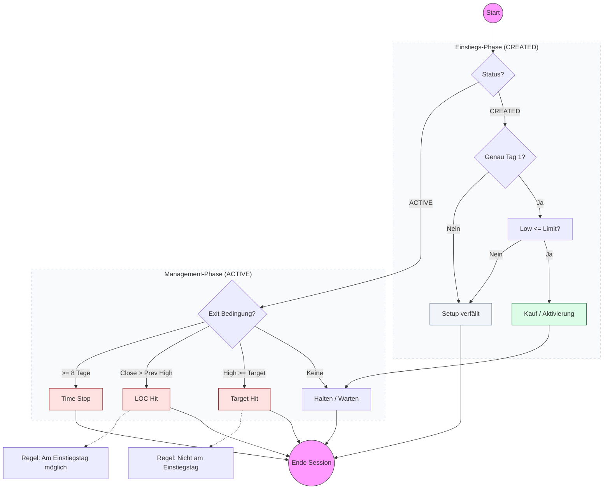

# Strategy Playbook: DipBuyer

- **Core Concept:** Mean-reversion setup that identifies oversold stocks in long-term uptrends, anticipating a short-term bounce.
- **Screener Ingestion:** Reads these fields for active symbols from `stocks.db`:
  - `close`: Closing price.
  - `open`: Opening price.
  - `high`: Daily high price.
  - `low`: Daily low price.
  - `volume`: Traded daily volume.
  - `date`: Trading day string.
- **Screener Rules & Filters:**
  - **Uptrend Trend Filter**: The closing price must be above its 200-day Simple Moving Average (SMA_200).
  - **Liquidity Filters**: 20-day Volume SMA must be $> 1,000,000$ and closing price must be $> \$5.0$.
  - **Consecutive Red Candles**: Both today's session and yesterday's session must be red candles (`Close < Open`).
  - **Dip Condition**: The price drop over 3 days (measured as $Price_{3} - Price_{0}$) divided by the 5-day ATR must be $< -1.0$.
  - **Volatility Buffer**: The 5-day ATR divided by the closing price must be $> 3\%$ (`volatility_ratio > 0.03`).
  - **IBS Filter**: Internal Bar Strength (IBS) must be $< 0.2$ (meaning: $\frac{\text{close} - \text{low}}{\text{high} - \text{low}} < 0.2$).
- **Signal Triggers:**
  - **Entry Price Limit**: `Close - ATR` (calculated at setup close).
  - **Stop-Loss**: None (`0.0`).
  - **Take-Profit**: `Entry + (0.8 * ATR)`.
- **Order Generation Rules:**
  - **Entry order type**: Limit (LMT) order placed at entry price.
  - **Lifespan**: Good-Till-Date (GTD) expiring at the end of the next trading day. Setup is invalidated if not filled on Day 1.
  - **Exit logic**: 
    - Target take profit order (Take Profit is active from Day 1 post-entry).
    - Limit On Close (LOC) order triggered if close price rises above the previous day's high.
    - Time Stop: Closed on the 8th trading day since entry.

---

## Strategy Decision Flowchart

