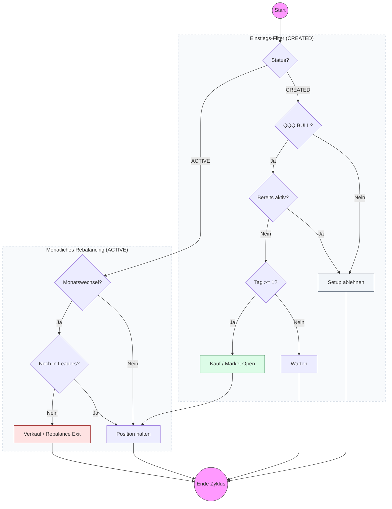

# Strategy Playbook: NDXMomentum

- **Core Concept:** Multi-asset relative strength strategy holding the top 5 momentum leaders in the NASDAQ-100 index, rebalanced monthly.
- **Screener Ingestion:** Reads daily closing prices from `stocks.db` for NASDAQ-100 constituent stocks plus the index tracking ETF `QQQ`:
  - `close`: Closing prices.
- **Screener Rules & Filters:**
  - **Screener Timing**: Executes strictly on the last trading day of each month (the last non-holiday weekday).
  - **QQQ Trend Filter**: The QQQ closing price must be above its 200-day Simple Moving Average (SMA_200) to trigger a rebalance. If QQQ is below SMA_200, no new positions are entered.
  - **Momentum Score Calculation**:
    - Calculate Rate of Change (ROC) percentages for each constituent over four lookback windows: 21, 63, 126, and 252 trading days.
    - Sum the four values: $\text{Momentum Score} = \text{ROC}_{21} + \text{ROC}_{63} + \text{ROC}_{126} + \text{ROC}_{252}$.
    - Rank all constituents by their score (highest first).
  - **Leaders Selection**: Select the top 5 highest-ranking constituent symbols.
- **Signal Triggers:**
  - **Entry**: Proposed at market open on the first trading day of the new month for any selected leader not currently held in the portfolio.
  - **Stop-Loss**: None (`0.0`).
  - **Take-Profit**: None (`0.0`).
- **Order Generation Rules:**
  - **Rebalancing**: 
    - Exit order (MKT) generated for symbols falling out of the top leaders list.
    - Entry order (MKT) generated for new leaders entering the top 5, sizing the position according to the allocated strategy budget.
  - **Lifespan**: Execution occurs at market open (DAY / MKT).

---

## Strategy Decision Flowchart

