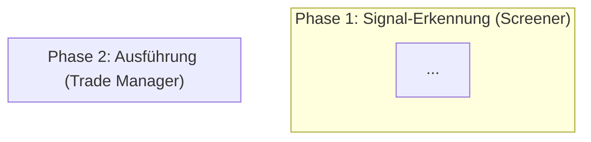
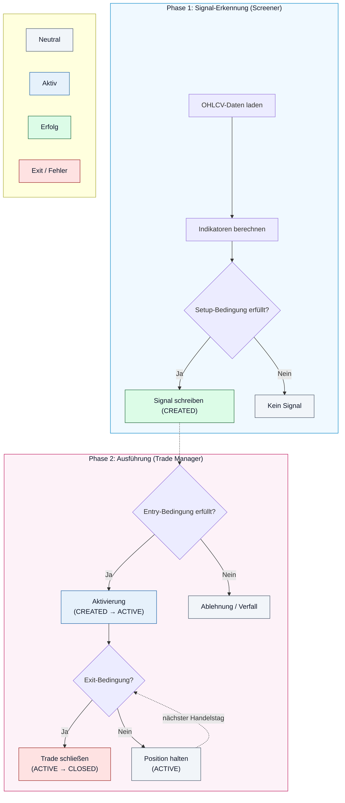

# Strategy Playbook Template — Neue Strategie anlegen

Dieses Template definiert die Struktur und Checklisten für jede neue Strategie. Es stellt sicher, dass die Rollentrennung zwischen Screener und Trade Manager von Anfang an korrekt implementiert wird.

---

## Checkliste: Screener-Implementierung

### 1. Strategie-Klasse

- [ ] Erbt von `BaseStrategy` (`app/services/screener/strategies/base.py`)
- [ ] Definiert `name: str` mit dem `Strategies`-Enum-Wert
- [ ] Implementiert `run(days, analysis_date) -> int`
- [ ] Gibt die Anzahl der generierten Signale zurück

### 2. Signal-Context (`signal_context`)

Der Screener muss folgende Felder im Context liefern:

| Feld | Pflicht | Erfassungszeitpunkt | Beschreibung |
|:---|:---:|:---|:---|
| `date` | ✅ | Screener (Phase 1) | ISO-Datum des Setups (`YYYY-MM-DD`) |
| `setup_close` | ✅ | Screener (Phase 1) | Closing-Preis zum Setup-Zeitpunkt |
| `source` | ✅ | Screener (Phase 1) | Immer `"ScreenerEngine"` oder `"screener"` |
| *Indikatoren (Unterstrich-Regel)* | ✅ | Screener (Phase 1) | z.B. `sma_200`, `rsi_2`, `atr_10`, `momentum_score` |
| *Dynamische Laufzeit-Metriken* | ❌ | Trade Manager (Phase 2) | z.B. `green_candle_count`, `target_exit_sma` |

### 3. Entry-Price Typ bestimmen

Welchen `entry_price` setzt der Screener?

```
Ist der Entry ein berechneter Limit-Preis (z.B. Close - ATR)?
  → Ja: entry_price = berechneter Limit-Preis
  → Nein: Ist der Entry der Close-Preis als Schwellenwert?
    → Ja: entry_price = Schwellenwert (z.B. min(Fri, Thu))
    → Nein: entry_price = current_close als Referenz (Trade Manager bestimmt Fill)
```

### 4. Duplikat-Check

- [ ] `trade_repository.exists(symbol, strategy, date)` vor `create_trade()`
- [ ] Optional: Check auf aktive Positionen (`get_by_status([CREATED, ACTIVE])`)

### 5. Telegram-Report

- [ ] Entscheidung: Sendet der Screener eine Telegram-Nachricht?
- [ ] Wenn ja: Welche Felder enthält die Tabelle?
- [ ] Format: `_send_telegram_report(title, date, dataframe)`

---

## Checkliste: Trade-Manager-Implementierung

### 1. Strategie-Klasse

- [ ] Erbt von `BaseTradeStrategy` (`app/services/trade_manager/strategies/abstract.py`)
- [ ] Definiert `name = Strategies.<Name>`
- [ ] Markiert mit `@final`
- [ ] Registriert in `TradeManager.strategies` (`manager.py`)
- [ ] Eingetragen in `_SINGLE_POSITION_STRATEGIES` (falls nur 1 Position erlaubt)

### 2. Pflicht-Methoden

| Methode | Verantwortung |
|:---|:---|
| `check_entry()` | Entry-Bedingung prüfen (`CREATED → ACTIVE`) |
| `_do_manage_active_trade()` | Exit-Logik (`ACTIVE → CLOSED`) |
| `_generate_entry_order()` | Order-Objekt für Entry erzeugen |
| `_generate_exit_order()` | Order-Objekt für Exit erzeugen |
| `get_current_parameters()` | Parameter für Anzeige berechnen |

### 3. Optionale Methoden

| Methode | Wann nötig |
|:---|:---|
| `get_daily_updates()` | Wenn `signal_context` täglich aktualisiert werden muss (z.B. `green_candle_count`) |

### 4. Position Sizing

- [ ] Nutzt `_resolve_position_size()` oder `_execute_activation()`
- [ ] Budget aus `settings.yaml` → `portfolio.strategies.<name>.budget`
- [ ] Risk aus `settings.yaml` → `portfolio.strategies.<name>.risk_amount`

---

## Checkliste: Sonderfälle

### Multi-Position / Monatliches Rebalancing (wie NDX Momentum)

- [ ] Screener erstellt monatlich N Kandidaten als `CREATED`
- [ ] Trade Manager prüft bei Monatswechsel: Symbol noch in Leaders-Liste?
  - Ja → Position halten (kein Rebalancing)
  - Nein → `REBALANCE_EXIT`
- [ ] Neue Leaders ohne bestehende Position → `REBALANCE_ENTRY`
- [ ] `extract_latest_leaders()` Methode für Leader-Vergleich

### Einzel-Asset (wie TGIM, BounceBandit, BridgeScout, TwoPercent)

- [ ] `_SINGLE_POSITION_STRATEGIES` Eintrag
- [ ] Duplikat-Check im Screener UND im Trade Manager

---

## Playbook-Struktur (für das .md-Dokument)

Jedes Strategie-Playbook folgt dieser Gliederung:

```markdown
# Strategy Playbook: <Name>

## Phase 1: Signal-Erkennung (Screener)
- Datenquellen und Indikatoren
- Setup-Bedingungen
- signal_context Felder
- entry_price Berechnung
- Telegram-Report (falls vorhanden)

## Phase 2: Ausführung & Management (Trade Manager)
- Entry-Logik (CREATED → ACTIVE)
- Exit-Logik (ACTIVE → CLOSED)
- Position Sizing
- Order-Typen (LMT, MKT, MOO, MOC)

## Strategy Decision Flowchart

```

---

## Mermaid-Vorlage mit Swimlanes


