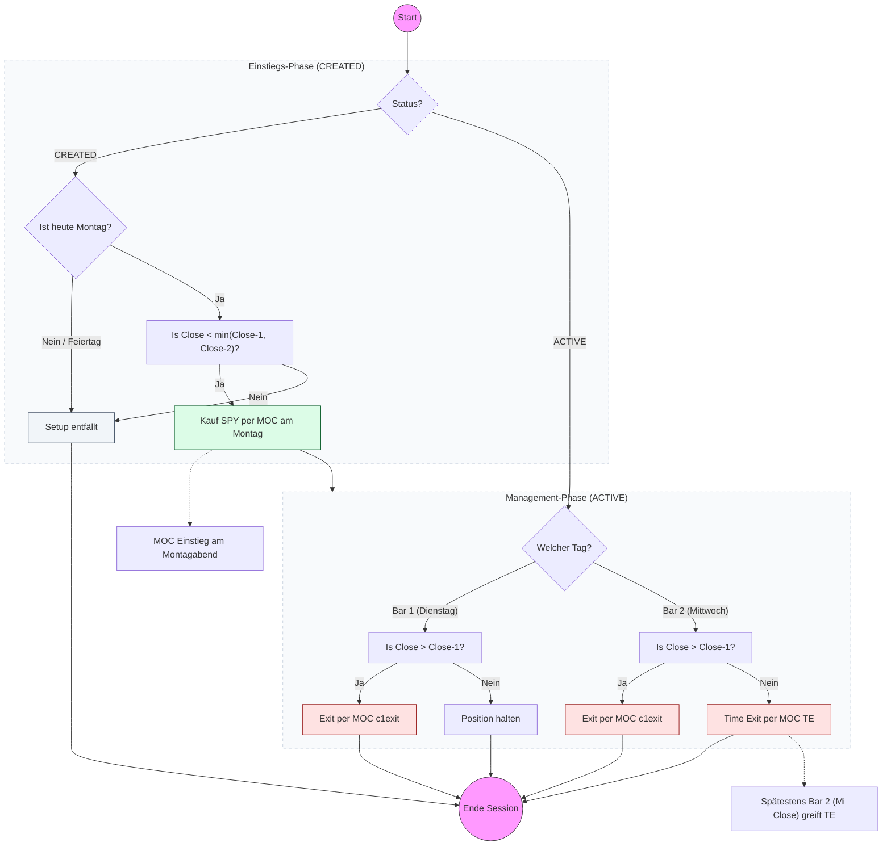

# Strategy Playbook: TGIM (Thank God It's Monday)

- **Core Concept:** Mean-reversion setup specifically traded on `SPY` (S&P 500 ETF) that identifies Monday oversold closes (at a 3-day low close) and captures a short-term bounce over the following 1–2 days.
- **Screener Ingestion:** Reads daily closing prices from `stocks.db` for the target symbol `SPY`:
  - `close`: Daily closing prices.
  - `date`: Trading day string.
- **Screener Rules & Filters:**
  - **Screener Timing & Day Filter**: Evaluated strictly on calendar Mondays (`DayOfWeek == 1`). If Monday is a public holiday, the strategy is skipped for the week.
  - **Constituent Selection**: Traded exclusively on `SPY` (no other assets screened).
  - **Lowest Close Condition**: `Close < min(Close[1], Close[2])` (Monday's close must be strictly lower than both Friday's close and Thursday's close).
  - **Duplicate Check**: Prevents signal duplication by checking if an active setup or trade for `SPY` and the signal date already exists in `signals.db`.
- **Signal Triggers & Order Types:**
  - **Entry Order Type**: Market On Close (MOC) on Monday close. (Executed as `order_type="MKT"` at the setup session closing price).
  - **Stop-Loss**: None (`0.0`).
  - **Take-Profit / Exit Logic**: Evaluated at `ThisClose` in strict priority order (`select`):
    1. `c1exit`: Exit Market On Close (MOC) if today's Close is higher than yesterday's Close (`Close > Close[1]`).
    2. `TE` (Time Exit): Exit Market On Close (MOC) if held for $\ge \text{bars\_p}$ bars (default $\text{bars\_p} = 2$, i.e. Wednesday close).
  - **MOC Execution Mapping**: In the execution layer, MOC orders are specified as `order_type="MKT"` with execution scheduled at market close.
- **Position Sizing & Risk Management:**
  - Standard **Budget-Based Fallback**: Calculated using standard portfolio allocation without a stop loss ($\text{size} = \lfloor \text{budget} / P_{\text{fill}} \rfloor$), configured via `portfolio.strategies.tgim.budget`.
- **Configurable Parameters:**
  - `bars_p`: Maximum holding duration in bars (default: `2`).
  - `target_symbol`: Target asset ticker (default: `"SPY"`).

---

## Exit Hierarchy Analysis (`bars_p = 2`)

With the default parameter $\text{bars\_p} = 2$, trade management progresses as follows:

1. **Montag (Bar 0 - Setup)**: Entry executed at Monday MOC (`ThisClose`). $\text{BarsHeld} = 0$.
2. **Dienstag (Bar 1)**: $\text{BarsHeld} = 1$.
   - Evaluates `c1exit`: Is $\text{Close}_{\text{Di}} > \text{Close}_{\text{Mo}}$?
     - **Ja**: Exit MOC am Dienstag (`c1exit`). Position geschlossen.
     - **Nein**: Position bleibt aktiv.
3. **Mittwoch (Bar 2)**: $\text{BarsHeld} = 2$.
   - Evaluates `c1exit`: Is $\text{Close}_{\text{Mi}} > \text{Close}_{\text{Di}}$?
     - **Ja**: Exit MOC am Mittwoch (`c1exit`). Position geschlossen.
     - **Nein**: Evaluates `TE` ($\text{BarsHeld} \ge 2$). Da $2 \ge 2$ wahr ist, schließt `TE` die Position bedingungslos MOC am Mittwoch.

> [!NOTE]
> Die Position wird bei $\text{bars\_p} = 2$ **garantiert spätestens am Mittwochabend** durch den Time Exit (`TE`) geschlossen.

---

## Strategy Decision Flowchart

