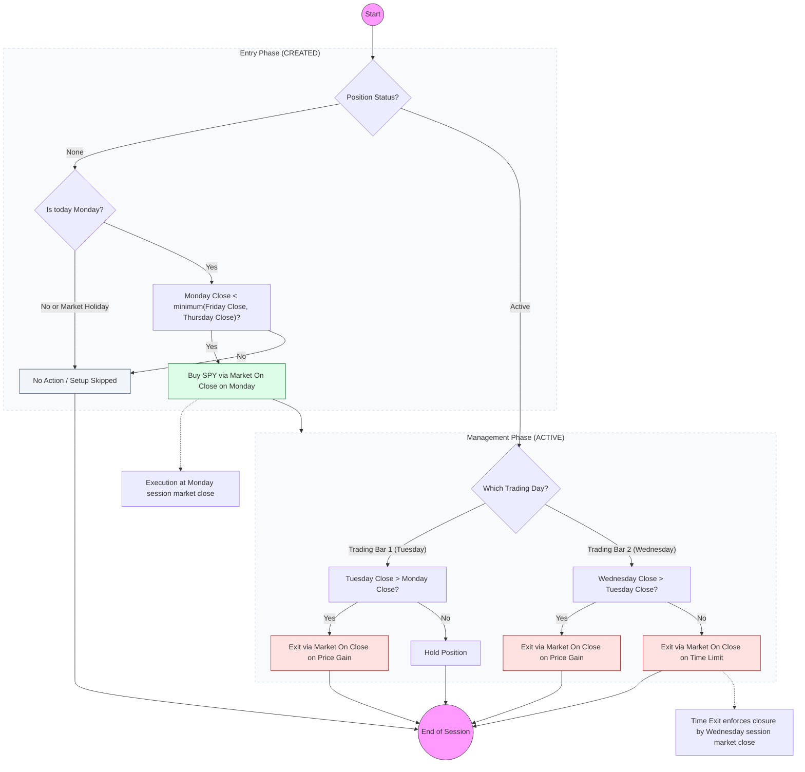

# Strategy Playbook: TGIM (Thank God It's Monday)

- **Core Concept:** Mean-reversion setup specifically traded on the target symbol `SPY` (SPDR Standard & Poor's 500 Exchange-Traded Fund Trust) that identifies Monday oversold closing prices (at a 3-day lowest closing price) and captures a short-term price recovery over the following 1 to 2 trading days.
- **Screener Ingestion:** Reads daily closing prices from the market database (`stocks.db`) for the target symbol `SPY`:
  - `close`: Daily closing price.
  - `date`: Trading day string.
- **Screener Rules & Filters:**
  - **Screener Timing & Day Filter**: Evaluated strictly on calendar Mondays (day of week equals Monday). If Monday is a public market holiday, the strategy is skipped for the week.
  - **Constituent Selection**: Traded exclusively on `SPY` (no other assets are screened).
  - **Lowest Close Condition**: `Monday Close < minimum(Friday Close, Thursday Close)` (Monday's closing price must be strictly lower than both Friday's closing price and Thursday's closing price).
  - **Duplicate Check**: Prevents signal duplication by checking if an active setup or trade record for `SPY` and the signal date already exists in the signals database (`signals.db`).
- **Signal Triggers & Order Types:**
  - **Entry Order Type**: Market On Close (executed as a market order at the setup session closing price on Monday evening).
  - **Stop-Loss**: None (`0.0`).
  - **Take-Profit / Exit Logic**: Evaluated at session closing price in strict priority order:
    1. **Close-1 Exit (c1exit)**: Exit Market On Close if today's closing price is higher than yesterday's closing price (`Close > Close[Vortag]`).
    2. **Time Exit (TE)**: Exit Market On Close if held for at least the bars holding duration parameter (`bars_p`, default: 2 trading days, which corresponds to Wednesday close).
  - **Execution Mapping**: In the execution layer, Market On Close orders are specified as market orders scheduled for execution at market close.
- **Position Sizing & Risk Management:**
  - Standard **Budget-Based Fallback**: Calculated using standard portfolio allocation without a stop-loss ($\text{size} = \lfloor \text{budget} / \text{fill\_price} \rfloor$), configured via portfolio strategy configuration.
- **Configurable Parameters:**
  - `bars_p`: Maximum holding duration in trading bars (default: `2` trading days).
  - `target_symbol`: Target asset ticker symbol (default: `"SPY"`).

---

## Exit Hierarchy Analysis (with holding duration parameter = 2)

With the default parameter setting of 2 holding bars, trade management progresses as follows:

1. **Monday (Trading Bar 0 - Setup)**: Entry executed at Monday Market On Close. Bars held count = 0.
2. **Tuesday (Trading Bar 1)**: Bars held count = 1.
   - Evaluates Close-1 Exit: Is Tuesday's closing price > Monday's closing price?
     - **Yes**: Exit Market On Close on Tuesday (Close-1 Exit). Position closed.
     - **No**: Position remains active.
3. **Wednesday (Trading Bar 2)**: Bars held count = 2.
   - Evaluates Close-1 Exit: Is Wednesday's closing price > Tuesday's closing price?
     - **Yes**: Exit Market On Close on Wednesday (Close-1 Exit). Position closed.
     - **No**: Evaluates Time Exit (Bars held count $\ge 2$). Since $2 \ge 2$ is true, Time Exit closes the position unconditionally at Wednesday Market On Close.

> [!NOTE]
> The position is **guaranteed to be closed at the latest on Wednesday evening** at market close by the Time Exit.

---

## Strategy Decision Flowchart

