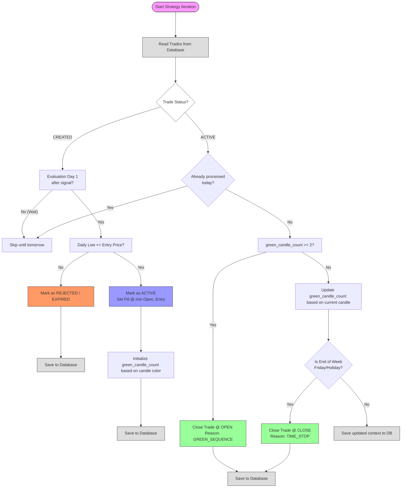

# Strategy Playbook: TurnoverTiming

- **Core Concept:** Exploits short-term institutional momentum shifts using price/turnover volume thresholds and weekly time stops.
- **Screener Ingestion:** Reads daily bars from `stocks.db` for the constituents of Nasdaq-100 (NDX), S&P 500 (SPX), and Russell 1000 (RUS):
  - `open`, `high`, `low`, `close`: Daily prices.
  - `volume`: Daily volume.
- **Screener Rules & Filters:**
  - **Screener Timing**: Runs at the last trading close of the week (normally Friday close, or Thursday if Friday is a holiday).
  - **Indicators Calculated**:
    - `turnover` = Close * Volume
    - `turnover_sma` = 20-day Simple Moving Average of turnover.
    - `sma_price` = 150-day Simple Moving Average of closing price.
    - `atr` = 3-day Average True Range (ATR).
  - **Ranking & Selection Cascade**:
    1. Rank all constituent symbols in each index by `turnover_sma` descending (highest turnover first).
    2. Exclude secondary share classes via `SymbolFilter`.
    3. Take the top 20 highest-turnover candidates in each index.
    4. Apply filters: `close > sma_price` (uptrend filter) and `atr > 0`.
    5. Select the top 4 candidates meeting these criteria per index.
    6. Deduplicate candidates across indices (merging index names if a symbol is in multiple indices).
- **Signal Triggers:**
  - **Entry Triggers**: The screener creates signals for two separate strategy variants:
    - **TurnOverTiming_0.5**: Limit Buy price is set to `Setup Close - (0.5 * ATR)` (using 3-day ATR).
    - **TurnOverTiming_1.0**: Limit Buy price is set to `Setup Close - (1.0 * ATR)` (using 3-day ATR).
  - **Entry Validation**: The entry limit order is strictly valid only on the first trading day following the setup day (normally Monday). If Monday is a public holiday, the entry window is extended to Tuesday. Otherwise, the setup is invalidated.
  - **Stop-Loss**: None (`0.0`).
  - **Take-Profit**: None (`0.0`).
- **Order Generation Rules:**
  - **Entry order type**: Limit (LMT) order. Valid strictly on the first trading day following the signal (normally Monday, or Tuesday if Monday is a holiday).
  - **Exit logic**: 
    - Early exit: Triggered when two consecutive trading days record green candles (`Close > Open`), checking the day's close and executing at the next day's open.
    - State tracking: Uses `green_candle_count`. Upon entry fill, if the setup day was green, it counts as 1. If the entry day itself is also green, `green_candle_count` is initialized to 2 (triggering the green sequence exit at the next day's open). If the current day is red or neutral, the count resets to 0.
    - Time Stop: Closed automatically at market close on Friday (MOC order).

---

## Strategy Decision Flowchart

