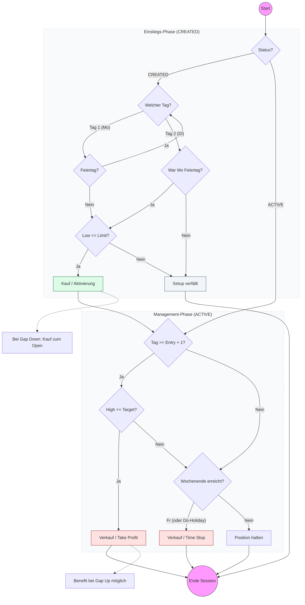

# Strategy Playbook: TwoPercent

- **Core Concept:** Mean-reversion setup specifically traded on `SXRV.DE` to capture weekend reversals or monday gap openings.
- **Screener Ingestion:** Reads daily closing prices from `stocks.db` for the target symbol `SXRV.DE`:
  - `close`: Closing prices.
- **Screener Rules & Filters:**
  - **Screener Timing**: Runs at the last trading close of the week (normally Friday close, or Thursday if Friday is a holiday).
  - **Constituent Selection**: Traded exclusively on `SXRV.DE` (no other assets screened).
  - **Duplicate Check**: Prevents signal duplication by checking if a trade proposal for the target symbol and signal date already exists in the trade repository.
- **Signal Triggers:**
  - **Entry Limit**: Limit buy placed at `Setup Close * 0.99` (1% discount). The entry trigger is strictly valid only on Monday. If Monday is a public holiday, the entry window is extended to Tuesday.
  - **Gap Opening Special Entry**: If Monday (or Tuesday, if Monday is a holiday) opens below the Limit Buy level, the entry fill price is adjusted to that day's opening price.
  - **Stop-Loss**: None (`0.0`).
  - **Take-Profit**: `Entry Price * 1.02` (+2%). Target only becomes active on Tuesday (Day + 1 post-setup, or Wednesday if Monday was a holiday).
- **Order Generation Rules:**
  - **Entry order type**: Limit (LMT) order. Valid strictly on Monday (or Tuesday if Monday is a holiday).
  - **Exit order type**: 
    - Limit (LMT) target exit at `Entry * 1.02` (Take Profit).
    - Market On Close (MOC) order triggered on Friday close if the target was not reached during the week (Time Stop).

---

## Strategy Decision Flowchart

