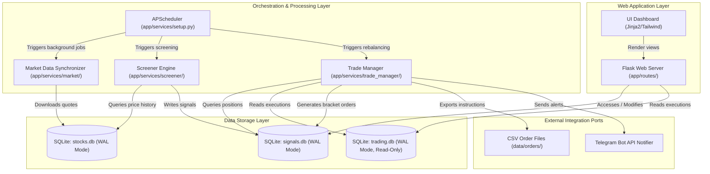

# 🐊 Croc-Trader

[](https://www.python.org/downloads/)
[](https://github.com/astral-sh/ruff)
[](https://github.com/pre-commit/pre-commit)
[](https://opensource.org/licenses/MIT)

An advanced End-of-Day (EOD) portfolio management, strategy screening, and trading analysis platform built with Python 3.12+ and Flask. 

Croc-Trader orchestrates background market data syncing, strategy evaluation, position sizing, and broker execution monitoring, backed by a robust SQLite data storage layer.

---

## 🚀 Key Features

* **Strategy Screening Engine:** Automates scanning across equities to identify setups based on technical indicators (ATR, SMA, RSI) and records setups.
* **Portfolio Trade Manager:** Queries active portfolios, computes position sizing (utilizing banking precision decimals), and exports execution orders.
* **Jinja2 & Tailwind Web Dashboard:** Elegant frontend interface displaying interactive analytics, performance indices, and active broker setups.
* **Asynchronous Orchestration:** APScheduler registers background jobs for market synchronization, screening, and rebalancing.
* **Alerting Integrations:** Direct integration with the Telegram Bot API for instant signaling and execution alerts.

---

## 📐 System Architecture

Croc-Trader strictly separates side effects from pure business logic following the **Functional Core / Imperative Shell** paradigm.



### Core Architecture Invariants
1. **Financial Precision:** Floating-point numbers are strictly forbidden for pricing or asset sizes. `decimal.Decimal` is used across all calculations.
2. **SQLite WAL Mode:** Databases use Write-Ahead Logging (`PRAGMA journal_mode=WAL;`) to prevent locking issues between Flask web requests and scheduler transactions.
3. **ReadOnly External Database:** `trading.db` is an external database containing actual broker executions and is queried strictly in read-only mode by the web app and trade manager to inspect executions.
4. **Stateless Core:** Rebalancing algorithms and indicator strategies are fully deterministic pure functions, making them easily testable without mocks.

---

## 📂 Project Structure

```text
├── .agent/                 # Agent configuration & workflows
├── app/                    # Main Flask Application
│   ├── routes/             # Blueprints (views, APIs, error handlers)
│   ├── services/           # Orchestration (Screener, Trade Manager, Market Sync)
│   ├── static/             # Static frontend assets (Tailwind CSS, Icons)
│   ├── templates/          # Jinja2 HTML templates
│   ├── config.py           # Configuration schema & loading logic
│   └── models.py           # Database transaction layers & model mapping
├── data/                   # Storage directory for SQLite databases and exported orders
├── scripts/                # Utility execution scripts
├── test/                   # Automated pytest suite
├── Dockerfile              # Docker image configuration
├── docker-compose.yml      # Orchestration definition for deployment
└── run.py                  # Entrypoint to run the Flask web application
```

---

## ⚙️ Configuration Setup

The system separates environment configurations, application run-time settings, and static metadata files:

### 1. Environment Configuration (`.env`)
Used for secrets and environment-specific toggles. Create it from the template:
```bash
cp .env.example .env
```
Key parameters:
* `SECRET_KEY`: Secure key for Flask session signing.
* `TELEGRAM_TOKEN` / `TELEGRAM_CHAT_ID`: Credentials for sending alerts.

### 2. Runtime Settings (`settings.yaml`)
The primary runtime settings file loaded by `app/config.py`. It configures:
* **Database Paths:** Target file names and directories for database assets.
* **Server Bindings:** Host and port settings for Flask web server.
* **Logging:** Target directories, rotation schemes, and logging verbosity.
* **Portfolio Budgets:** Capital allocation configuration for strategies (`dip_buyer`, `turnover_timing`, etc.).


### 3. Data Calendars & Strategy Metadata (`data/`)
Static definitions containing market schedule specifications:
* **`data/ranking_2026.yaml`:** Strategy priority ranking criteria for target equities.
* **`data/holidays.yaml`:** Defined holidays list used to adjust screening and execution schedules.

---

## 🛠️ Quick Start

### 1. Local Development (Manual Setup)

Create and configure a clean virtual environment using Python 3.12+:

```bash
# Create and activate virtual environment
python3.12 -m venv .venv
source .venv/bin/activate

# Install dependencies (development and execution)
pip install -r requirements.txt

# Run the web server locally
python run.py
```
The application will serve locally at `http://127.0.0.1:5000`.

### 2. Running with Docker Compose

To spin up the web application and environment setup via containers:

```bash
docker-compose up --build -d
```

---

## 🧪 Developer Guidelines & Quality Gates

This repository enforces strict code standard checks. Changes must pass formatting, security scans, and tests before committing.

### Code Style and Formatting
We utilize `ruff` for all formatting and lint inspections. Prior to push, run:

```bash
# Auto-format codebase
.venv/bin/ruff format .

# Audit codebase for syntax rules & complexity
.venv/bin/ruff check .
```

### Running Automated Tests
Validate local changes against our unit and integration tests using `pytest`:

```bash
.venv/bin/pytest
```

### Git Pre-Commit Hooks
Pre-commit hooks are configured to automate checking formatting, lint warnings, and database synchronizations. Install the hooks using:

```bash
.venv/bin/pre-commit install
```
