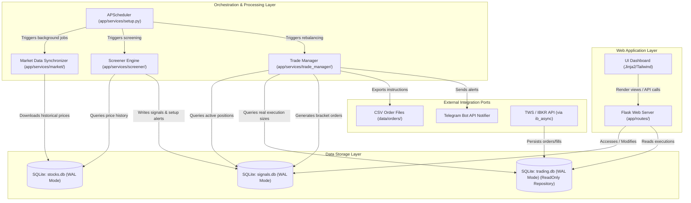

# Croc-Trader High-Level System Architecture

High-density technical overview of the Croc-Trader EOD portfolio management and trading analysis platform.

---

## 1. System Component Interactions

---

## 2. High-Level Dataflow Topologies

### 2.1 Market Data Synchronization
1. **Trigger**: APScheduler runs the updater daily.
2. **Fetch**: `app/services/market/updater.py` pulls historical equity quotes and distributions from yfinance.
3. **Persist**: Writes to `data/stocks.db` utilizing standard parameterized SQL queries.

### 2.2 Screener Scan & Signal Generation
1. **Trigger**: APScheduler fires the Screener Engine.
2. **Compute**: `app/services/screener/engine.py` reads historical prices from `stocks.db` and computes ATR, SMA, and RSI indicator states.
3. **Record**: Evaluates candidates against rule logic and stores active setups in `signals.db`.

### 2.3 Portfolio Rebalancing & Bracket Order Export
1. **Trigger**: APScheduler triggers the Trade Manager.
2. **Process**: `app/services/trade_manager/manager.py` queries active positions, validates new entries, runs position sizing, and logs orders in `signals.db`.
3. **Export**: Outputs bracket orders as CSV into `data/orders/orders_YYYY_MM_DD.csv`.

---

## 3. Global Invariants

- **Execution Environment**: Strictly target **Python 3.12+**.
- **Financial Accounting Precision**: Float data types are strictly prohibited for ledgers, cash values, or price calculations. Use `decimal.Decimal` objects (using banker's rounding) to ensure exact precision.
- **Database Concurrency (WAL Mode)**: All SQLite databases (`stocks.db`, `signals.db`, `trading.db`) MUST operate in Write-Ahead Logging (WAL) mode (`PRAGMA journal_mode=WAL;`) to allow concurrently active read queries from the Flask UI without blocking execution writes.
- **Stateless Execution Layers**: Core logic components (Screener strategies and Trade Manager rebalancers) must be stateless. They reconstruct context on-the-fly from the underlying database state on every run.
- **Functional Core / Imperative Shell**:
  - **Functional Core**: All mathematical modeling, indicator computations, and sizing algorithms must be pure, side-effect-free functions.
  - **Imperative Shell**: Handles network calls, file system exports, SQLite transactions, and log dispatching, validating boundary contracts before invoking the core.
- **SQL Parametrization**: String concatenation or format interpolation for raw SQL query composition is strictly prohibited to prevent SQL injection vulnerability risk.
