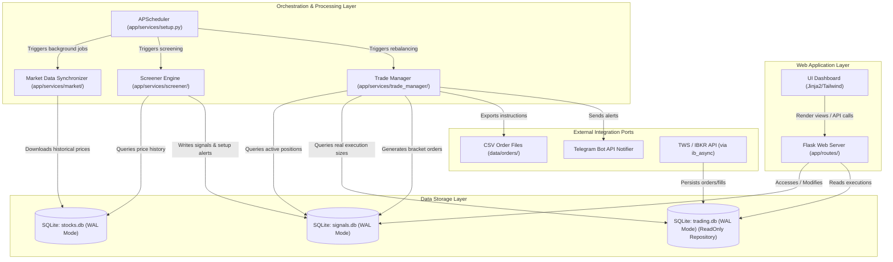

# Croc-Trader High-Level System Architecture

High-density technical overview of the Croc-Trader EOD portfolio management and trading analysis platform.

---

## 1. System Component Interactions

---

## 2. High-Level Dataflow Topologies

### 2.1 Market Data Synchronization
1. **Trigger**: APScheduler runs the updater daily. APScheduler may host the synchronous jobs, but each EOD workflow remains internally synchronous and is configured to prevent overlapping executions.
2. **Fetch**: `app/services/market/updater.py` pulls historical equity quotes and distributions from yfinance.
3. **Persist**: Writes to `data/stocks.db` utilizing standard parameterized SQL queries.

### 2.2 Screener Scan & Signal Generation
1. **Trigger**: APScheduler fires the Screener Engine.
2. **Compute**: `app/services/screener/engine.py` reads historical prices from `stocks.db` and computes ATR, SMA, and RSI indicator states.
3. **Record**: Evaluates candidates against rule logic and stores active setups in `signals.db`.

### 2.3 Portfolio Rebalancing & Bracket Order Export
1. **Trigger**: APScheduler triggers the Trade Manager.
2. **Process**: `app/services/trade_manager/manager.py` queries active positions, validates new entries, runs position sizing, and logs orders in `signals.db`.
3. **Export**: Outputs bracket orders as CSV into `data/orders/orders_YYYY_MM_DD.csv`.

---

## 3. Global Invariants

- **Execution Environment**: Strictly target **Python 3.12+**.
- **Synchronous End-of-Day Execution:** Application and batch processing are
  synchronous. Do not introduce `asyncio`, `async def`, asynchronous framework
  layers, or concurrent order-processing flows. External libraries may contain
  asynchronous internals only when encapsulated behind an existing synchronous
  repository interface and required by an approved integration.
  The `ib_async` integration is isolated behind the existing synchronous broker
  repository or adapter boundary. Application services and domain logic must not
  expose awaitable APIs or asynchronous control flow.
- **Non-Overlapping Daily Runs:** A daily workflow for the same responsibility
  must not run concurrently. Scheduler configuration and application-level
  guards must prevent overlapping instances.
- **Idempotent Trading-Date Processing:** Re-running a job for the same trading
  date and identical input snapshot must not create duplicate signals, orders,
  exports, or postings.
- **Explicit Trading Date and Timezone:** Daily workflows use an explicit
  timezone and trading date. Business logic must not infer the trading date
  from an uncontrolled local system clock.
- **Market-Data Cutoff:** Signal and order generation must verify the expected
  market-data as-of date and reject or explicitly report stale or incomplete
  inputs.
- **Atomic Persistence and Export:** Related state transitions are committed
  transactionally. Order files are written atomically and must not expose
  partially written output.
- **Safe Retry:** A failed run may be retried without duplicating completed
  effects. Retry behavior must distinguish completed, partial, and unstarted
  work.
- **Deterministic Core:** Given the same validated input snapshot,
  configuration, trading date, and portfolio state, the functional core must
  produce the same decisions.
- **Financial and Analytical Precision:**
  - Ledger balances, cash amounts, fees, realized monetary values, settlement
    values, and final order values must use `decimal.Decimal` or an approved
    integer minor-unit representation.
  - Market prices, returns, technical indicators, statistical calculations,
    and Pandas-based analysis may use floating-point values where required by
    the analytical libraries and documented contracts.
  - Conversion from analytical floating-point values to monetary or order
    values must apply an explicit precision, tick-size, and rounding policy.
  - Monetary rounding uses the domain-approved rounding mode at the system
    boundary.
- **Database Concurrency (WAL Mode)**: All SQLite databases (`stocks.db`, `signals.db`, `trading.db`) MUST operate in Write-Ahead Logging (WAL) mode (`PRAGMA journal_mode=WAL;`) to allow concurrently active read queries from the Flask UI without blocking execution writes.
- **Stateless Execution Layers**: Core logic components (Screener strategies and Trade Manager rebalancers) must be stateless. They reconstruct context on-the-fly from the underlying database state on every run.
- **Functional Core / Imperative Shell**:
  - **Functional Core**: All mathematical modeling, indicator computations, and sizing algorithms must be pure, side-effect-free functions.
  - **Imperative Shell**: Handles network calls, file system exports, SQLite transactions, and log dispatching, validating boundary contracts before invoking the core.
- **SQL Parametrization**: String concatenation or format interpolation for raw SQL query composition is strictly prohibited to prevent SQL injection vulnerability risk.

---

## Architecture-Relevant Public Components

This document records architecture-relevant components and contracts, not a
manual inventory of every public function or class.

The architecture-relevant public surfaces are:

- application configuration and dependency composition,
- scheduler and daily batch orchestration,
- market-data synchronization,
- screener and strategy execution boundaries,
- portfolio allocation and position sizing,
- trade lifecycle and order generation,
- persistence repositories and database ownership,
- CSV and broker integration boundaries,
- web application and external notification interfaces.

Detailed function and class inventories are derived from source code and must
not be maintained manually in this document.
