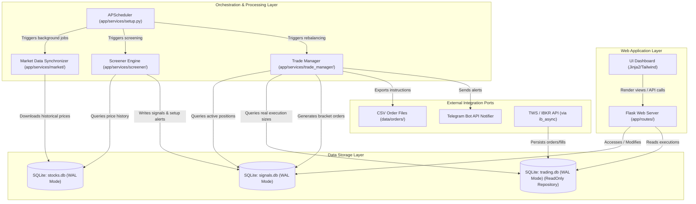

# Croc-Trader High-Level System Architecture

High-density technical overview of the Croc-Trader EOD portfolio management and trading analysis platform.

---

## 1. System Component Interactions

---

## 2. High-Level Dataflow Topologies

### 2.1 Market Data Synchronization
1. **Trigger**: APScheduler runs the updater daily.
2. **Fetch**: `app/services/market/updater.py` pulls historical equity quotes and distributions from yfinance.
3. **Persist**: Writes to `data/stocks.db` utilizing standard parameterized SQL queries.

### 2.2 Screener Scan & Signal Generation
1. **Trigger**: APScheduler fires the Screener Engine.
2. **Compute**: `app/services/screener/engine.py` reads historical prices from `stocks.db` and computes ATR, SMA, and RSI indicator states.
3. **Record**: Evaluates candidates against rule logic and stores active setups in `signals.db`.

### 2.3 Portfolio Rebalancing & Bracket Order Export
1. **Trigger**: APScheduler triggers the Trade Manager.
2. **Process**: `app/services/trade_manager/manager.py` queries active positions, validates new entries, runs position sizing, and logs orders in `signals.db`.
3. **Export**: Outputs bracket orders as CSV into `data/orders/orders_YYYY_MM_DD.csv`.

---

## 3. Global Invariants

- **Execution Environment**: Strictly target **Python 3.12+**.
- **Financial Accounting Precision**: Float data types are strictly prohibited for ledgers, cash values, or price calculations. Use `decimal.Decimal` objects (using banker's rounding) to ensure exact precision.
- **Database Concurrency (WAL Mode)**: All SQLite databases (`stocks.db`, `signals.db`, `trading.db`) MUST operate in Write-Ahead Logging (WAL) mode (`PRAGMA journal_mode=WAL;`) to allow concurrently active read queries from the Flask UI without blocking execution writes.
- **Stateless Execution Layers**: Core logic components (Screener strategies and Trade Manager rebalancers) must be stateless. They reconstruct context on-the-fly from the underlying database state on every run.
- **Functional Core / Imperative Shell**:
  - **Functional Core**: All mathematical modeling, indicator computations, and sizing algorithms must be pure, side-effect-free functions.
  - **Imperative Shell**: Handles network calls, file system exports, SQLite transactions, and log dispatching, validating boundary contracts before invoking the core.
- **SQL Parametrization**: String concatenation or format interpolation for raw SQL query composition is strictly prohibited to prevent SQL injection vulnerability risk.

---

## 4. Public API Component Index

Below is an index of all public functions, classes, and strategies implemented within the `app` package, included to satisfy documentation checks:

* **App Configuration & Context:** `AppConfig`, `ConfigManager`, `CrocContext`, `DatabaseConfig`, `DatabaseSession`, `EnvConfig`, `LoggingConfig`, `SecurityConfig`, `WebhookWorkerConfig`, `WebserverConfig`, `HolidayConfig`, `IndexAliases`, `CrocSetupStrategy`
* **Data Sources & Repositories:** `ActivePositionRecord`, `BaseRepository`, `BrokerRepository`, `ExecutionRecord`, `MarketRepository`, `OrderRecord`, `SettlementRecord`, `SignalRepository`, `TradeRepository`, `YahooDataProvider`, `YahooRow`, `PriceData`, `TradeData`, `MarketPrice`, `PreferredSymbols`, `SymbolExchange`, `TargetColumn`
* **Market Services:** `ExchangeMapper`, `MarketDataProvider`, `MarketDataUpdater`, `MarketHolidayChecker`, `MarketQualityService`, `SymbolFilter`, `sync_market_data`, `ingest_webhook`, `reload_market_data`, `run_market_data_update`, `perform_gap_check`, `get_symbols_with_missing_history`
* **Screener & Strategies:** `BaseStrategy`, `BaseTradeStrategy`, `DipBuyerStrategy`, `DipBuyerConfig`, `DipBuyerMarketState`, `HoldTargetStrategy`, `NDXMomentumScreener`, `NDXMomentumConfiguration`, `NDXMomentumTradeStrategy`, `TurnoverTimingStrategy`, `TurnoverConfiguration`, `TurnoverContext`, `TurnoverSignalContext`, `TurnoverCandidate`, `TwoPercentStrategy`, `TwoPercentStrategyContext`, `StrategyProtocol`, `Strategies`, `StrategyOverview`, `CrocSignal`, `check_entry`, `EntryReason`, `ExitReason`
* **Portfolio & Sizing:** `PortfolioAllocator`, `PortfolioConfig`, `PortfolioManager`, `PortfolioMetrics`, `PortfolioStrategyConfig`, `DynamicPositionSizer`, `AllocationResult`, `allocate`, `apply_limits`, `calculate_position_size`, `get_current_utilization`, `get_budget`, `get_risk_amount`
* **Trade Management:** `TradeTransition`, `TradeStatus`, `TradeParams`, `TradeEventType`, `OrderLeg`, `WebhookPayload`, `CrocSignal`, `create_trade`, `update_trade`, `clear_trades`, `get_trade`, `get_trades`, `get_active_trades`, `get_active_positions`, `get_broker_active_trades`, `get_broker_settlements`, `get_broker_summary`, `get_closed_summary`, `get_orders_by_local_trade_id`, `get_orders_by_status`, `get_executions_for_order`, `get_executions_for_trade_group`, `get_unprocessed_signals`, `get_signals_by_date`, `get_signal_by_id`, `get_all_by_strategy`
* **Metrics & Analytics:** `MetricsOverview`, `SimulationResult`, `BacktestMetrics`, `SQNClassification`, `NDXAnalysisResult`, `SymbolAnalysisResult`, `SignalStat`, `calculate_atr`, `calculate_ema`, `calculate_expectancy`, `calculate_ibs`, `calculate_kelly_criterion`, `calculate_max_drawdown`, `calculate_multiplier`, `calculate_profit_factor`, `calculate_risk_reward_ratio`, `calculate_roc`, `calculate_rsi`, `calculate_sharpe_ratio`, `calculate_sma`, `calculate_sqn`, `calculate_true_range`, `calculate_ulcer_index`, `calculate_volume_sma`, `calculate_win_rate`
* **Web Views & Controllers:** `create_app`, `health_check`, `to_local_tz`, `favicon`, `robots_txt`, `apple_touch_icon`, `apple_touch_icon_precomposed`, `view_analytics_dashboard`, `view_backtest_dashboard`, `view_broker_dashboard`, `view_screener_croc`, `view_screener_dip_buyer`, `view_screener_ndx_momentum`, `view_screener_overview`, `view_screener_turnover`, `view_screener_twopercent`, `view_trades_croc`, `view_trades_dip_buyer`, `view_trades_ndx_momentum`, `view_trades_overview`, `view_trades_turnover`, `view_trades_twopercent`
* **System Utilities & Webhooks:** `configure_scheduler`, `register_services`, `run_all`, `run_cache_prewarm`, `run_daily_process`, `run_daily_strategy_check`, `run_db_backup`, `run_db_maintenance`, `run_order_generation`, `run_update`, `vulture_whitelist`, `check_ranking_attributes`, `extract_latest_leaders`, `extract_symbol_data`, `filter_symbols`, `from_dict`, `from_row`, `from_yahoo`, `generate_daily_orders`, `generate_donut_chart`, `generate_orders`, `generate_sparkline`, `get_all_daily_data`, `get_all_known_symbols`, `get_all_orders`, `get_all_recommendations`, `get_all_traded_symbols`, `get_available_dates`, `get_batch_history`, `get_batch_history_raw`, `get_by_status`, `get_by_timestamp`, `get_candidates`, `get_current_parameters`, `get_daily_updates`, `get_data_for_lookback`, `get_db_path`, `get_exchange`, `get_float`, `get_folder`, `get_handler`, `get_holiday_name`, `get_ignored_symbols`, `get_index_stats`, `get_int`, `get_latest_date`, `get_latest_price`, `get_latest_signal_date`, `get_log_path`, `get_net_positions_by_symbol`, `get_ohlcv`, `get_outdated_symbols`, `get_path`, `get_percentile`, `get_portfolio_summary`, `get_reconciliation_discrepancies`, `get_settlements`, `get_strat_config`, `get_strategy`, `get_strategy_display_name`, `get_strategy_path`, `get_symbol_history`, `get_symbol_history_raw`, `get_trade_candidates`, `get_trading_days_count`, `get_turnover_candidates`, `get_unique_signal_attributes`, `get_universe_daily_data`, `group_trades_by_symbol`, `group_trades_history`, `harmonize_indices`, `ignore_symbol`, `ingest_webhook`, `init_schema`, `internal_server_error`, `is_holiday`, `is_strategy_match`, `manage_active_trade`, `map_order_to_csv_rows`, `normalize_timestamp`, `page_not_found`, `preload_all_data`, `prepare_trade_view`, `process_daily_signals`, `register_strategy`, `remove_ignored_symbol`, `require_ip_whitelist`, `require_lock`, `resolve_strategy`, `risk_range`, `robots_txt`, `root_check`, `route_honeypot_admin`, `route_honeypot_login`, `should_block`, `special_symbols`, `to_db_row`, `trigger_orders`, `trigger_screener`, `trigger_trades_backfill`, `verify_ranking_system`, `write_csv_orders_file`, `app_config`, `database_config`, `logging_config`, `webserver_config`, `webhook_worker_config`, `security_config`, `telegram_config`, `portfolio_config`, `portfolio_strategy_config`, `symbol_override`, `dow_30`, `nasdaq_100`, `russell_1000`, `russell_1000_exclusive`, `sp_500`, `clear_cache`, `clear_trades`, `connect`, `exists`, `fetch_all`, `fetch_batch_raw`, `fetch_one`, `fetch_value`, `save_bulk_prices`, `save_signal`, `send`, `send_dataframe`, `send_message`, `dataclass_to_dict`, `vulture_whitelist.py`, `wrapper`, `attach_sparklines`, `ScreenerConfiguration`, `ScreenerViewService`, `TradeViewData`, `TradeViewService`, `CapacityMonitor`, `CapacitySimulator`, `OverflowProtection`, `RankingVerificationResult`, `TurnoverConfiguration`, `TurnoverSignalContext`, `MissingRouteRateLimiter`, `NDXAnalysisResult`, `NDXMomentumConfiguration`, `NDXMomentumTradeStrategy`, `TurnoverContext`, `ExchangeSymbol`, `SymbolOverride`, `TechnicalIndicatorConfig`, `TelegramBot`, `TelegramConfig`, `analyze_croc`, `analyze_dip_buyer`, `analyze_ndx_momentum`, `analyze_single_symbol`, `analyze_turnover`, `calculate_analysis`, `execute`, `get_weekday_stats`, `mapping`
