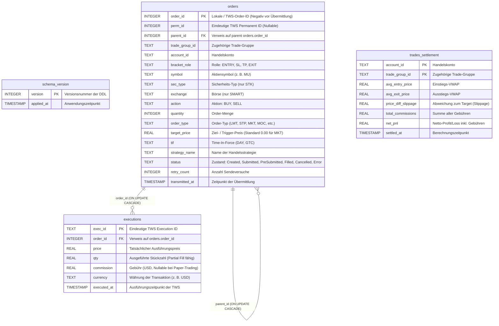
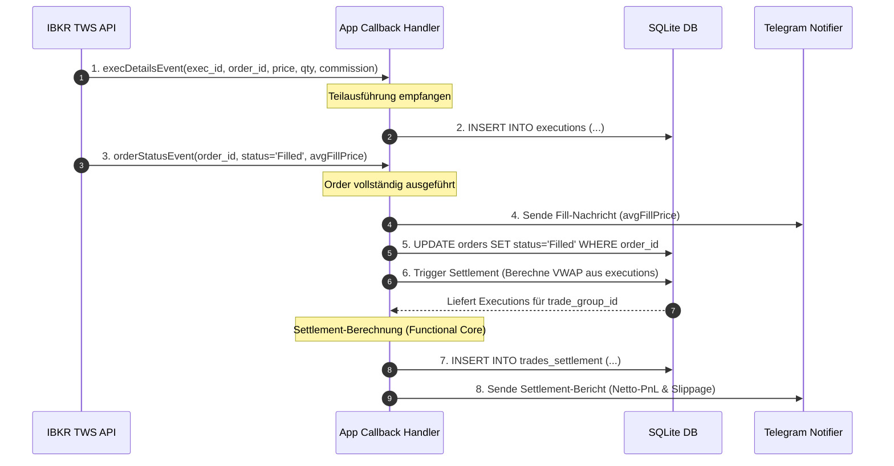
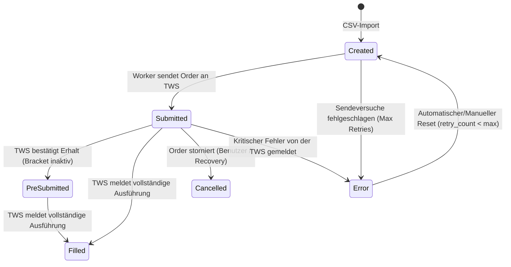

# Architekturdokumentation der Trading-Datenbank (`trading.db`)

Diese Dokumentation beschreibt die Struktur, die Tabellen, die Beziehungen und die logischen Datenflüsse der SQLite-Datenbank `trading.db`, welche als zentraler Zustandsspeicher für das **TradeManager**-System dient. Sie richtet sich an alle Entwickler des Projekts, um ein einheitliches Verständnis der Datenhaltung und der Transaktionsabläufe sicherzustellen.

---

## 1. Übersicht & Design-Entscheidungen

### 1.1 Datenbank-Engine & Betriebsmodus
*   **SQLite (asynchron):** Die Datenbank wird über die Bibliothek `aiosqlite` asynchron betrieben, um den Event-Loop von `asyncio` nicht zu blockieren.
*   **Write-Ahead Logging (WAL) Modus:** Die Datenbank ist im WAL-Modus konfiguriert (`PRAGMA journal_mode=WAL;`). Dies ermöglicht hervorragende Parallelität: Lesende Hintergrunddienste (z. B. der `AlertWatcher`) blockieren keine schreibenden Transaktionen (z. B. den `OrderWorker`).
*   **Fremdschlüssel-Erzwingung:** Fremdschlüsselprüfungen sind standardmäßig aktiv (`PRAGMA foreign_keys=ON;`).

### 1.2 Datenintegrität über Immutability
Im Python-Code (`app/core/models.py`) sind alle Datenbankzeilen als unveränderliche Dataclasses (`@dataclass(frozen=True)`) wie [OrderRow](file:///Users/produktmanagement/Python/github/TradeManager/app/core/models.py#L59) oder [ExecutionRow](file:///Users/produktmanagement/Python/github/TradeManager/app/core/models.py#L110) abgebildet. 
Zustandsänderungen (z. B. Statusänderungen einer Order) erzeugen im Speicher neue Instanzen mittels `dataclasses.replace` und werden unmittelbar in der SQLite-Datenbank persistiert.

---

## 2. Entity-Relationship (ER) Diagramm

Das folgende Diagramm zeigt die Tabellen der Datenbank, ihre Spalten und deren Beziehungen untereinander:



---

## 3. Tabellendefinitionen im Detail

### 3.1 Tabelle `schema_version`
Speichert die angewandten SQL-Migrationsschritte.

| Spalte | Typ | Constraints | Beschreibung |
| :--- | :--- | :--- | :--- |
| `version` | INTEGER | PRIMARY KEY | Fortlaufende Versionsnummer (z. B. `1`, `2`). |
| `applied_at` | TIMESTAMP | DEFAULT `CURRENT_TIMESTAMP` | Zeitpunkt, an dem die Migration ausgeführt wurde. |

### 3.2 Tabelle `orders`
Repräsentiert die Handelsabsicht (Intention). Alle Order-Typen (Entry, Stop Loss, Take Profit, sonstige Exits) werden hier verwaltet.

| Spalte | Typ | Constraints | Beschreibung |
| :--- | :--- | :--- | :--- |
| `order_id` | INTEGER | PRIMARY KEY | Eindeutige ID. Kann beim Import negativ sein (siehe 4.1). |
| `perm_id` | INTEGER | UNIQUE INDEX | Eindeutige permanente ID der TWS (wichtig für Zuweisung von Events). |
| `parent_id` | INTEGER | FK `orders(order_id) ON UPDATE CASCADE` | Referenziert die Einstiegsorder bei Brackets. |
| `trade_group_id` | TEXT | NOT NULL | ID zur Gruppierung zusammenhängender Orders (z. B. `TG_20260701_MU`). |
| `account_id` | TEXT | NOT NULL | IBKR Handelskonto-Kennung (z. B. `U1234567`). |
| `bracket_role` | TEXT | CHECK (`bracket_role` IN ('ENTRY', 'SL', 'TP', 'EXIT')) | Rolle der Order innerhalb der Trade-Gruppe. |
| `symbol` | TEXT | NOT NULL | Ticker-Symbol des Basiswerts (z. B. `AAPL`). |
| `sec_type` | TEXT | CHECK (`sec_type` = 'STK') | Wertpapiertyp. Aktuell sind nur Aktien (`STK`) zugelassen. |
| `exchange` | TEXT | CHECK (`exchange` = 'SMART') | Börsenplatz. Standardmäßig auf `SMART` fixiert. |
| `action` | TEXT | CHECK (`action` IN ('BUY', 'SELL')) | Kauf- oder Verkaufsorder. |
| `quantity` | INTEGER | NOT NULL | Stückzahl. |
| `order_type` | TEXT | NOT NULL | IBKR Order-Typ (z. B. `LMT`, `STP`, `MKT`, `MOC`, `LOC`). |
| `target_price` | REAL | Nullable | Geplanter Ausführungspreis. Bei Market-Orders standardmäßig `0.00`. |
| `tif` | TEXT | DEFAULT 'GTC' | Time-In-Force (z. B. `DAY`, `GTC`). |
| `strategy_name` | TEXT | Nullable | Name der auslösenden Strategie. |
| `status` | TEXT | CHECK (`status` IN ('Created', ...)) | Lebenszyklus-Zustand (siehe Kapitel 5). |
| `retry_count` | INTEGER | DEFAULT 0 | Zähler für Fehlversuche bei der TWS-Übermittlung. |
| `transmitted_at`| TIMESTAMP | Nullable | Zeitstempel, wann die Order an die TWS übermittelt wurde. |

#### Constraints & Indizes auf `orders`:
1.  **Unique Constraint (Composite Key für Import):**
    ```sql
    UNIQUE (account_id, trade_group_id, bracket_role, order_type)
    ```
    *Ermöglicht den wiederholten Import von CSV-Dateien ohne Duplikate und erlaubt seit Migration `002` mehrere Exit-Orders (z. B. ein Limit-Exit `LMT` und ein Market-on-Close-Exit `LOC`) innerhalb derselben Trade-Gruppe.*
2.  **Partieller Index auf `perm_id`:**
    ```sql
    CREATE UNIQUE INDEX idx_orders_perm_id ON orders (perm_id) 
    WHERE perm_id IS NOT NULL AND perm_id != 0;
    ```
    *Ermöglicht eine eindeutige Zuordnung der von der TWS gemeldeten Status-Events via `perm_id`, erlaubt jedoch gleichzeitig beliebig viele importierte Orders im Zustand `Created` (bei denen `perm_id` noch `NULL` oder `0` ist).*
3.  **Performance-Indizes:**
    *   `idx_orders_trade_group` auf `trade_group_id` (beschleunigt das Settlement und Abfragen geschlossener Trades).
    *   `idx_orders_status` auf `status` (beschleunigt die Arbeitsschleife des Order-Workers).

---

### 3.3 Tabelle `executions`
Speichert Teilausführungen (Fills und Partial Fills) einer Order. Da IBKR Orders in Tranchen ausführen kann, stehen hier die tatsächlichen realisierten Transaktionspreise und -mengen.

| Spalte | Typ | Constraints | Beschreibung |
| :--- | :--- | :--- | :--- |
| `exec_id` | TEXT | PRIMARY KEY | Eindeutige Ausführungs-ID von IBKR (z. B. `0001a2b3.60d00f.01.01`). |
| `order_id` | INTEGER | FK `orders(order_id) ON UPDATE CASCADE` | Verknüpfte lokale Order-ID. |
| `price` | REAL | NOT NULL | Tatsächlich realisierter Kurs dieser Teiltranche. |
| `qty` | REAL | NOT NULL | Ausgeführte Stückzahl dieser Teiltranche. |
| `commission` | REAL | Nullable | Gebühren für diesen Teil-Fill (kann bei Paper-Trading fehlen oder verzögert eintreffen). |
| `currency` | TEXT | Nullable | Währung der Gebühren (z. B. `USD`). |
| `executed_at` | TIMESTAMP | Nullable | Ausführungszeitpunkt laut TWS. |

#### Indizes auf `executions`:
*   `idx_executions_order_id` auf `order_id` (beschleunigt die Aggregation von Fills zur VWAP-Berechnung beim Settlement).

---

### 3.4 Tabelle `trades_settlement`
Konsolidiert die Ergebnisse vollständig abgewickelter (geschlossener) Trades. Sie dient als Datenquelle für Performance-Reports.

| Spalte | Typ | Constraints | Beschreibung |
| :--- | :--- | :--- | :--- |
| `account_id` | TEXT | PRIMARY KEY (Teil 1) | Zugehöriges Handelskonto. |
| `trade_group_id`| TEXT | PRIMARY KEY (Teil 2) | ID der Trade-Gruppe. |
| `avg_entry_price`| REAL | NOT NULL | Volumengewichteter Durchschnittspreis (VWAP) aller Einstiegs-Ausführungen. |
| `avg_exit_price`| REAL | NOT NULL | Volumengewichteter Durchschnittspreis (VWAP) aller Ausstiegs-Ausführungen. |
| `price_diff_slippage`| REAL | NOT NULL | Abweichung des realisierten Einstiegskurses vom Zielpreis (`target_price`). |
| `total_commissions`| REAL | NOT NULL | Summe aller angefallenen Transaktionsgebühren für Einstieg und Ausstieg. |
| `net_pnl` | REAL | NOT NULL | Netto-Gewinn oder Verlust (unter Berücksichtigung von Richtung, Menge und Gebühren). |
| `settled_at` | TIMESTAMP | DEFAULT `CURRENT_TIMESTAMP` | Berechnungszeitpunkt. |

---

## 4. Zentrale Datenflusskonzepte

### 4.1 Die Kaskadierung temporärer negativer IDs
Beim ersten Import von Order-Legs (z. B. aus einer CSV-Datei) existiert noch keine Verbindung zur Interactive Brokers TWS. Neue Orders werden mit einer **temporären negativen ID** (z. B. `-1`, `-2`) in der Tabelle `orders` angelegt.

Sobald der `OrderWorker` die Order an die TWS sendet, generiert die TWS eine offizielle, positive `orderId`. 
Der Worker führt dann ein Update der `order_id` in der Tabelle `orders` durch:
```sql
UPDATE orders SET order_id = :tws_order_id WHERE order_id = :negative_id;
```
Aufgrund des Constraints `FOREIGN KEY (parent_id) REFERENCES orders (order_id) ON UPDATE CASCADE` wird die ID-Änderung der Einstiegsorder **automatisch** auf das Feld `parent_id` aller verknüpften Child-Orders (z. B. Stop Loss oder Take Profit) in der Datenbank übertragen. Dies verhindert verwaiste Datensätze während des Übermittlungsprozesses.

---

### 4.2 Ereignisgesteuerter Datenfluss (Event & Timing)
Der Datenfluss zwischen der TWS, der Datenbank und Benachrichtigungen verläuft wie folgt:



1.  **Teilausführung:** Sobald ein Trade (oder ein Teil davon) ausgeführt wird, sendet die TWS ein `execDetailsEvent`. Das System speichert diesen Datensatz direkt in der Tabelle `executions`.
2.  **Vollständige Ausführung:** Meldet die TWS den Status `Filled` im `orderStatusEvent`, wird der von TWS gemeldete Durchschnittspreis (`avgFillPrice`) sofort per Telegram gemeldet, und der Status der Order in `orders` auf `Filled` gesetzt.
3.  **Settlement:** Direkt im Anschluss wird die Settlement-Routine angestoßen. Sie holt alle Ausführungen (ENTRY und EXITS) aus `executions`, berechnet über den *Functional Core* ([calculate_settlement](file:///Users/produktmanagement/Python/github/TradeManager/app/trading/settlement.py#L273)) den gewichteten Einstiegs-/Ausstiegspreis, die Slippage sowie das Netto-PnL und schreibt dies in `trades_settlement`. Abschließend wird der aggregierte Settlement-Bericht per Telegram versendet.

---

## 5. Order-Status-Lebenszyklus

Orders durchlaufen vordefinierte Zustände, die in der Datenbank im Feld `status` abgebildet werden:



*   **Created:** Die Order ist importiert, aber noch nicht an die TWS übermittelt.
*   **Submitted:** Die Order wurde an die TWS gesendet und wartet auf Verarbeitung.
*   **PreSubmitted:** Tritt primär bei inaktiven Bracket-Child-Orders (z. B. Stop Loss) auf, die erst aktiv geschaltet werden, sobald der Einstieg gefüllt wurde.
*   **Filled:** Die Order wurde vollständig ausgeführt.
*   **Cancelled:** Die Order wurde storniert.
*   **Error:** Ein fataler Fehler trat auf oder die maximale Anzahl an Übermittlungsversuchen (`retry_count`) wurde überschritten.

---

## 6. Wartung & Diagnose

### 6.1 Integritätsprüfung beim Startup
Vor jedem Anwendungsstart führt das System eine Prüfung der SQLite-Datenbank aus:
```sql
PRAGMA integrity_check;
```
Sollte die Prüfung fehlschlagen (z. B. Datenbank korrupt), bricht die Anwendung den Startvorgang ab (`sys.exit(1)`) und alarmiert die Entwickler per Telegram.

### 6.2 Hilfreiche Diagnose-Abfragen für Entwickler

**Offene Orders anzeigen:**
```sql
SELECT order_id, trade_group_id, bracket_role, symbol, action, quantity, status 
FROM orders 
WHERE status NOT IN ('Filled', 'Cancelled');
```

**Zusammenfassung des realisierten Gewichts eines Trades (VWAP-Check):**
```sql
SELECT order_id, SUM(qty) AS total_qty, SUM(qty * price) / SUM(qty) AS vwap 
FROM executions 
GROUP BY order_id;
```

**Bestehende Settlements prüfen:**
```sql
SELECT trade_group_id, avg_entry_price, avg_exit_price, net_pnl, settled_at 
FROM trades_settlement 
ORDER BY settled_at DESC;
```
